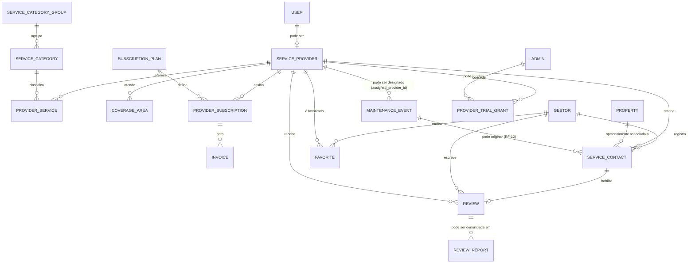
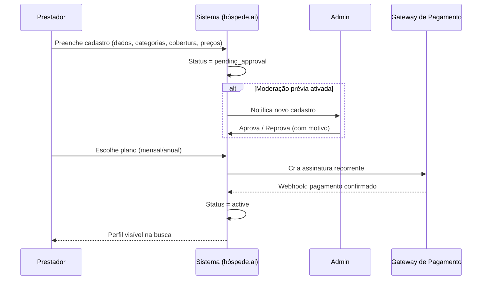
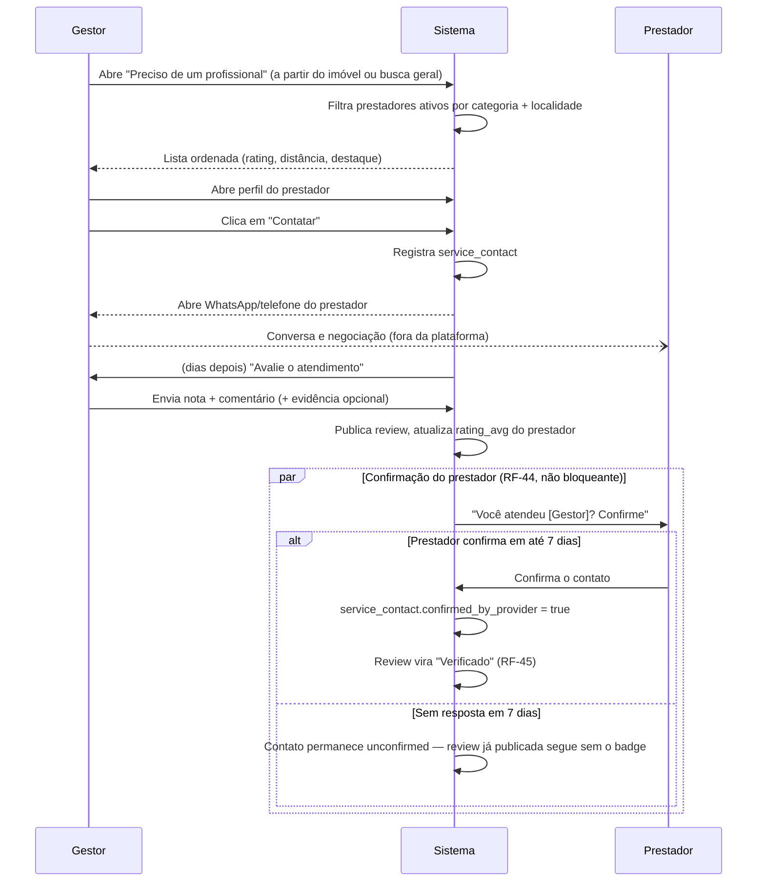
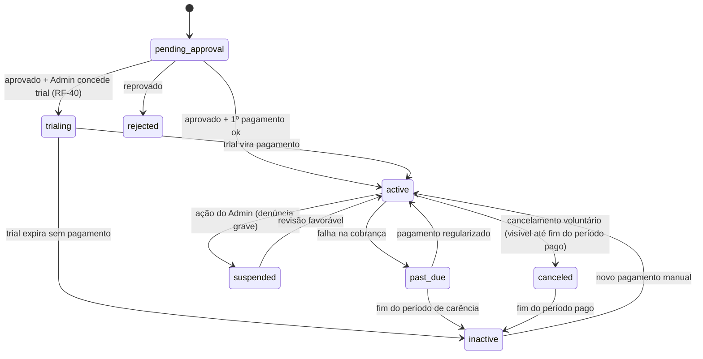

# Estudo de Viabilidade — Conecta Prestadores (Marketplace de Manutenção e Serviços Operacionais) para hóspede.ai

**Status:** Rodada 11 — landing page pública de marketing (RF-54, seção 5.9), dupla audiência (gestor + prestador), reaproveitando o padrão real de `components/products/*` (hero + `Tag` + comparativo antes/depois + CTA final) já usado pelas landings dos outros módulos do hóspede.ai. É de lá que o prestador entra no fluxo de cadastro (RF-01). Rodada 10: nova seção "Preços de referência" no cadastro (RF-03). Rodada 9: card independente em `/selection`, desbloqueado em todos os planos. Rodada 8: entrada contextual vira "Buscar prestador" na aba Manutenção. Rodada 7: corrige "tempo médio de resposta". Rodada 6: validação de reviews. Rodada 5: catálogo em 12 grupos/48 subcategorias. Rodada 4: módulo renomeado para **Conecta Prestadores** (era "Comunidade de Prestadores")
**Data:** 2026-08-29
**Autor:** Claude Code (a pedido de Renan)
**Objetivo deste documento:** consolidar a ideia descrita, avaliar viabilidade, e especificar requisitos funcionais, não funcionais, modelo de dados, fluxos e pontos de integração — para servir de base à próxima rodada de análise e à decisão de implementação.
**Fonte técnica:** `renanrba/hospedeai-v2` (leitura direta do código e de `docs/ARQUITETURA.md` do produto).

> **Nota sobre o contexto técnico (atualizada).** A primeira versão deste documento foi escrita só com acesso ao `renanrba/amsa` (uma ferramenta pontual, o Airbnb Message Scraper & Analyzer) — sem visibilidade do produto principal. Esta revisão já lê o código real do sistema, `renanrba/hospedeai-v2`, e substitui as premissas por fatos confirmados de arquitetura (seções 8 e 10). O que ainda depende de decisão de produto/negócio continua listado na seção 15.

**Stack confirmada do hóspede.ai (`hospedeai-v2`):** React 19 + Vite no front-end (`components/`, `hooks/`, `services/`); API serverless em `api/v1/*` (Vercel Functions); banco e autenticação no Supabase (Postgres + Auth JWT + Row Level Security); multi-tenant via tabela `tenants` + `tenant_id` em cada tabela de domínio, com policies de RLS chamando `get_auth_tenant_id()`; **Stripe já integrado e em produção** para a assinatura do gestor (checkout, webhooks e billing portal, cobrando em BRL); Google Maps JS API + Leaflet/`react-leaflet` já são dependências do projeto (usados hoje para o guia de "lugares próximos" do hóspede); IA via Gemini (assistente "ARIA"). Ver `docs/ARQUITETURA.md` no próprio repositório do produto para a documentação oficial dessa arquitetura.

---

## 1. Contexto e problema a resolver

Gestores de imóveis de curta temporada (Airbnb e similares) têm uma janela de tempo curta e inflexível entre check-out e check-in (turnover) para resolver qualquer problema estrutural — elétrica, hidráulica, ar-condicionado, fechaduras, etc. Hoje essa dor é resolvida de forma informal: grupos de WhatsApp, indicação boca a boca, ou busca genérica em marketplaces não especializados (GetNinjas, 99Jobs, grupos de Facebook). Isso gera:

- Tempo de resposta lento e imprevisível;
- Nenhuma garantia de qualidade/reputação do prestador;
- Risco direto de cancelamento/reembolso da próxima hospedagem por falha não resolvida a tempo.

A proposta é criar, dentro do hóspede.ai, uma **comunidade/marketplace de prestadores de serviço** segmentada por localidade e categoria, para que gestores encontrem rapidamente mão de obra qualificada e avaliada por outros gestores da própria rede.

## 2. Modelo de negócio

- **Gestor (cliente do hóspede.ai):** usa a busca/contratação **gratuitamente** — é um benefício agregado ao produto principal (aumenta retenção e valor percebido da assinatura do gestor). *(decidido — rodada 9)* Isso vale para **qualquer gestor autenticado, mesmo no plano Starter/free e mesmo sem nenhum imóvel cadastrado em Gestão de Imóveis** — Conecta Prestadores é acessível direto pela tela `/selection` (`DashboardSelection.tsx`), como um card independente, não atrás do gate de plano que trava os outros módulos (`gestaoDeImoveis`, `guestExperienceOS` etc. em `services/plans.ts`). É uma decisão deliberada de **crescimento dos dois lados do marketplace**: quanto maior a base de gestores buscando, maior a demanda percebida pelos prestadores, e vice-versa — network effect clássico de marketplace de dois lados. Um gestor "só de Conecta Prestadores" não é receita perdida: a monetização do módulo já vem inteira do lado do prestador (ver abaixo); mais gestores gratuitos = mais motivo pro prestador pagar pra ficar visível.
- **Prestador de serviço:** paga uma **taxa de assinatura (mensal ou anual com desconto)** para ficar **ativo e visível** no marketplace. Prestador inadimplente/inativo desaparece das buscas.
- **Pagamento do serviço em si** (o conserto do ar-condicionado, a diária de limpeza, etc.) é **combinado e pago diretamente entre gestor e prestador, fora da plataforma**. O hóspede.ai não intermedeia esse pagamento, não retém comissão sobre ele e **não deve ser confundido com um marketplace transacional** (tipo iFood) — é um **diretório/vitrine pago para o lado da oferta**, no modelo de GetNinjas/Houzz Pro, mas fechado à rede de gestores hóspede.ai.

Essa escolha de monetização (assinatura da oferta, não comissão sobre transação) tem implicações diretas no desenho do produto:
- Não precisamos de wallet, split de pagamento, escrow ou gateway de pagamento *entre usuários* — reduz muito a complexidade e a responsabilidade regulatória (não somos intermediário financeiro da transação de serviço).
- Precisamos apenas de **cobrança recorrente B2B2C** (hóspede.ai → prestador), que é um problema já bem resolvido por gateways brasileiros.
- O maior risco de negócio não é técnico, é de **cold start de marketplace** (ver seção 12): sem prestadores não há gestores interessados, sem gestores buscando não há prestadores dispostos a pagar. A estratégia de lançamento importa tanto quanto a especificação técnica.

## 3. Personas

| Persona | Descrição | Objetivo no módulo |
|---|---|---|
| **Gestor** | Usuário do hóspede.ai — administra um ou mais imóveis de temporada, **ou** *(novo — rodada 9)* usa só o Conecta Prestadores sem nenhum imóvel cadastrado (plano Starter/free, entrada direta pelo `/selection`) | Encontrar rapidamente, por bairro/cidade e categoria, um prestador confiável; contatar; avaliar depois |
| **Prestador de serviço** | Autônomo (MEI) ou pequena empresa (eletricista, encanador, técnico de ar-condicionado, diarista/faxina, chaveiro, dedetizadora, piscineiro, jardineiro, marido de aluguel, pintor etc.) | Ser encontrado por gestores da região, construir reputação, gerar leads recorrentes |
| **Admin hóspede.ai** | Equipe interna | Moderar cadastros, gerenciar categorias/planos, tratar denúncias, acompanhar métricas do módulo |

## 4. Escopo por fase

| Fase | Conteúdo | Racional |
|---|---|---|
| **Fase 0 — Discovery** | ✅ Decisões de produto tomadas diretamente (seção 15): moderação prévia, cidade piloto (João Pessoa/PB), trial gratuito, contas separadas, geocodificação já na Fase 1. Faixa de preço tem uma proposta inicial (seção 5.6.1), ainda a validar. O roteiro de entrevista já está pronto (`docs/questionario-discovery-fase0.md`) e vale aplicar em uma amostra de gestores/prestadores de João Pessoa para calibrar preço e categorias antes de travar os planos | Reduz risco residual antes de construir, mesmo com as decisões macro já tomadas |
| **Fase 1 — MVP** | Cadastro de prestador com **cobertura em cascata estado→cidade→bairro** e **upload de documentos** (CPF/RG, CNPJ — RF-42), catálogo de categorias ampliado (RF-09), **disponibilidade** (24h/fins de semana/feriados — RF-43) como campo e filtro, geocodificação de `properties.address` e da cobertura do prestador (RF-04/RF-12), **botão "Buscar prestador" dentro da aba Manutenção já existente** (RF-12/RF-51, rodada 8), item de menu geral dentro do grupo "Rotina" e **card próprio em `/selection`, desbloqueado em todos os planos** (RF-13/RF-52/RF-53, rodada 9), busca + filtro, contato via WhatsApp/telefone, avaliação pós-contato, assinatura mensal/anual (Stripe), trial gratuito concedido pelo Admin (RF-40), fila de aprovação manual (RF-35), **dashboard de métricas do Admin com seletor de período** (RF-38), **landing page pública dupla-audiência gestor/prestador** (RF-54, rodada 11) | Escopo maior que um MVP mínimo por decisão do produto |
| **Fase 2** | Destaque pago/ordenação por prioridade, notificações automáticas ("avalie seu prestador"), painel do prestador com métricas de visualizações/contatos, verificação por selfie (reforça o documento já coletado na Fase 1) | Aumenta conversão e ARPU depois que o piloto em João Pessoa validar a monetização |
| **Fase 3 (futuro)** | Chat interno, **relay via WhatsApp Business Platform/Cloud API para medir tempo de resposta real** (rodada 7, ver seção 10 item 10 — substitui os proxies RF-49/RF-50 da Fase 1, se valer o investimento), orçamento/proposta estruturada dentro da plataforma, **agenda de disponibilidade com horários/slots específicos** (a Fase 1 só cobre os *flags* 24h/fim de semana/feriado do RF-43, não uma agenda real), aplicativo/PWA do prestador, split opcional de pagamento para quem quiser | Só depois de validar tração no MVP |

Este documento cobre principalmente **Fase 1 e 2** em detalhe, e lista a Fase 3 apenas como visão de longo prazo.

---

## 5. Requisitos Funcionais (RF)

### 5.1 Cadastro e perfil do prestador

- **RF-01** O prestador deve poder se cadastrar de forma independente do fluxo de gestor (landing page própria "Seja um prestador parceiro" — conteúdo detalhado no RF-54), informando: nome/razão social, CPF ou CNPJ, telefone (WhatsApp), e-mail, foto/logo, descrição livre (bio), anos de experiência (opcional).
- **RF-02** *(atualizado — rodada 5: catálogo em 2 níveis)* O prestador deve selecionar **uma ou mais subcategorias de serviço** (ver 5.2) dentre um catálogo controlado pelo hóspede.ai, organizado em **grupos** (ex.: "Manutenção Predial e Reparos") contendo cada um várias **subcategorias** selecionáveis (ex.: Elétrica, Hidráulica, Pintura) — não texto livre, para permitir busca estruturada. A subcategoria é o nível efetivamente salvo em `provider_service`/usado na busca; o grupo é só organização visual (cadastro em acordeão por grupo, RF-11).
- **RF-03** *(esclarecido — rodada 10: os wireframes tinham o preço aparecendo no card de busca e no perfil, mas nenhuma tela de cadastro pra inserir esse dado — corrigido)* Para cada subcategoria selecionada (RF-02), o prestador informa um **preço base** e a unidade (por visita/por hora/por m²/sob consulta) numa seção própria "Preços de referência" — logo abaixo da seleção de categorias no cadastro, listando só as subcategorias marcadas. Quando a unidade é "sob consulta", não há campo de valor — mostra só "Combinado diretamente com o gestor". É apenas referencial, não vinculante.
- **RF-04** *(escopo ampliado para a Fase 1 — rodada 4: seleção em cascata)* O prestador define sua **área de cobertura** escolhendo **estado → cidade** (dropdowns dependentes) e, após selecionar a cidade, o sistema exibe **todos os bairros cadastrados daquela cidade** para seleção múltipla — em vez de um campo de texto livre. Cada bairro/cidade fica associado a lat/lng geocodificado (ver seção 15, item 7), viabilizando busca por proximidade. O catálogo de cidades/bairros começa restrito a João Pessoa/PB (piloto), mas a estrutura já suporta outras cidades sem redesenho — pré-requisito para expansão futura.
- **RF-05** O prestador pode anexar até N fotos de trabalhos anteriores (portfólio) — opcional no MVP.
- **RF-06** *(decidido)* Cadastro entra como `pending_approval` e **exige aprovação manual do Admin** antes de ficar visível — moderação prévia, não reativa. O Admin faz um cross-check das informações (documento, categorias declaradas, dados de contato, **documentos enviados — RF-42**) antes de aprovar (ver RF-35 e fluxo 9.1).
- **RF-07** O prestador pode editar seus dados, categorias, preços e cobertura a qualquer momento; edições sensíveis (documento, categorias) podem re-disparar revisão.
- **RF-08** O prestador pode pausar voluntariamente sua visibilidade (ex.: período de férias) sem cancelar a assinatura.
- **RF-42** *(novo — rodada 4)* Upload de documentos para verificação, **privados** (visíveis só para o Admin no cross-check de RF-06, nunca no perfil público): CPF ou RG do titular (sempre obrigatório); quando o cadastro é pessoa jurídica (CNPJ informado — RF-01), documento do CNPJ também é obrigatório; foto de perfil/logo continua separada (essa sim pública, já prevista em RF-01) e não é tratada como documento de verificação.
- **RF-43** *(novo — rodada 4)* Prestador informa sua **disponibilidade**: atende em horário comercial (padrão), e pode marcar adicionalmente "Atende 24h (emergências)", "Atende fins de semana" e "Atende feriados". Exibido no perfil público (RF-17) e usável como filtro de busca pelo gestor (RF-16) — diferencial relevante para chamados urgentes de turnover fora do horário comercial.

### 5.2 Catálogo de categorias de serviço

- **RF-09** *(catálogo reestruturado — rodada 5: 2 níveis, orientado à operação de temporada)* O catálogo deixa de ser uma lista plana e passa a ter **12 grupos**, cada um com suas subcategorias (48 no total), pensados para cobrir todo o ciclo operacional de um imóvel de temporada — não só manutenção reativa. Editável pelo Admin (RF-11) em ambos os níveis.

  | Grupo | Subcategorias |
  |---|---|
  | 1. Limpeza e Housekeeping *(essencial)* | Limpeza de Turnover, Limpeza Profunda, Lavanderia, Organização |
  | 2. Manutenção Predial e Reparos | Elétrica, Hidráulica, Marcenaria, Pintura, Reparos Gerais |
  | 3. Climatização e Conforto | Ar-condicionado, Ventilação, Aquecimento |
  | 4. Piscina e Área Externa | Limpeza de Piscina, Manutenção de Piscina, Jardinagem, Área Externa |
  | 5. Eletrodomésticos e Equipamentos | Linha Branca, TV e Entretenimento, Pequenos Eletros |
  | 6. Segurança e Tecnologia | Fechaduras e Acessos, Câmeras e Monitoramento, Alarmes, Internet e Wi-Fi, Automação Residencial |
  | 7. Controle de Pragas e Dedetização | Dedetização, Desratização, Descupinização, Controle de Mosquitos |
  | 8. Hospitality e Experiência do Hóspede | Reposição de Amenities, Welcome Kit, Concierge, Enxoval e Decoração |
  | 9. Inspeção e Vistoria | Vistoria de Entrada, Vistoria de Saída, Inspeção Periódica, Laudo Técnico |
  | 10. Mudança e Logística | Frete e Transporte, Armazenamento, Montagem e Desmontagem |
  | 11. Serviços Especializados | Chaveiro 24h, Vidraçaria, Serralheria, Impermeabilização, Telhado e Calhas |
  | 12. Serviços Administrativos e Suporte | Fotografia, Anúncios e Listing, Tradução, Contabilidade |

  > **Nota de escopo.** Os grupos 8 e 12 trazem um perfil de prestador diferente de "mão de obra" (eletricista, encanador etc.): reposição de amenities, concierge, fotografia de listing, tradução, contabilidade são **serviços de apoio operacional e hospitality**, não manutenção física. É uma expansão de escopo deliberada do marketplace — de "conserto de imóvel" para "tudo que o gestor terceiriza na operação" — que usa o mesmo fluxo de cadastro/aprovação/cobrança (RF-01–RF-08), sem exigir nada estrutural adicional. Vale revisitar o texto de RF-01/onboarding para não soar só para "prestador de manutenção" quando o público final é mais amplo.
- **RF-10** Cada subcategoria tem ícone, nome e descrição curta usada na busca ("Estou com problema no ar-condicionado" → mapeia para a subcategoria "Ar-condicionado", dentro do grupo "Climatização e Conforto").
- **RF-11** Admin pode criar, renomear, arquivar (nunca excluir, para não quebrar histórico) grupos e subcategorias, e reordenar subcategorias dentro de um grupo.

### 5.3 Busca e descoberta (lado do gestor)

- **RF-12** *(reescrito — rodada 8: entrada contextual real, não mais genérica)* O ponto de entrada contextual **não é um botão solto na tela do imóvel** — é o botão **"Buscar prestador"** dentro da aba **Manutenção** já existente em produção (`MaintenanceTab.tsx`, grupo de menu "Rotina" — ver nota abaixo), em cada `maintenance_event` (evento de manutenção de um imóvel específico). Abre o Conecta Prestadores já filtrado por **categoria** (mapeada do `category`/`maintenance_service_types` do evento — catálogo livre por tenant, ver RF-51) e **localidade** (do imóvel, via `properties.address` geocodificado — seção 10 item 4, seção 15 item 7). Ao escolher um prestador, os campos já existentes **"Responsável"** (`responsible_name`) e **"Telefone do Resp."** (`responsible_phone`) do evento são preenchidos automaticamente com os dados do prestador — reaproveita um campo que já existe hoje (hoje só texto livre, sem link a nenhum cadastro).
- **RF-13** *(ampliado — rodada 9: dois pontos de entrada geral)* (a) item **"Conecta Prestadores"** dentro do grupo de menu **"Rotina"** já existente (junto de Estoque, Manutenção, Previsão Financeira, Área Host, Avaliações), dentro do dashboard de Gestão de Imóveis — **não** um grupo novo de sidebar; (b) **card próprio na tela `/selection`** (`DashboardSelection.tsx`, "Escolha sua Área de Operação"), ao lado dos cards existentes (Gestão de Imóveis, Guest Experience OS, ARIA, Smart Market Engine, Smart Host), permitindo acessar o marketplace **sem nunca entrar em Gestão de Imóveis**. Usado para busca livre por categoria + localidade, sem partir de um evento de manutenção específico.
- **RF-52** *(novo — rodada 9)* O card "Conecta Prestadores" em `/selection` é **desbloqueado em todos os planos, incluindo Starter/free** — diferente de todos os outros cards da tela, que são gateados por flag de feature do plano (`planFeatures.gestaoDeImoveis`, `.guestExperienceOS` etc. em `services/plans.ts`). Decisão deliberada (seção 2): crescer a base de gestores, mesmo sem nenhuma relação com o produto principal pago, aumenta a demanda percebida pelo lado do prestador — e a monetização do módulo já é 100% pelo lado do prestador, então um gestor "só marketplace" não é receita perdida.
- **RF-53** *(novo — rodada 9)* Gestor sem nenhum imóvel cadastrado (entrada via RF-52, sem passar por Gestão de Imóveis) não tem contexto de bairro/cidade para pré-carregar (RF-12 não se aplica — não há `properties`/`maintenance_events`). Nesse caso a busca (RF-13b) abre com o seletor de localização em cascata **estado → cidade → bairros** (o mesmo componente cascata já usado no cadastro do prestador, RF-04) como fluxo principal, não como fallback secundário — e fica sempre editável mesmo para gestores com imóvel, caso queiram buscar em outra região.
- **RF-51** *(novo — rodada 8)* Mapeamento categoria do evento → subcategoria do catálogo: como `maintenance_service_types` é um catálogo **livre, por tenant** (o gestor cria os próprios tipos), diferente do catálogo controlado `service_category` (RF-09), a plataforma tenta um match por nome ao abrir "Buscar prestador"; sem correspondência confiável, o gestor escolhe manualmente a subcategoria antes de ver os resultados — nunca força uma equivalência automática errada.
- **RF-14** Resultado lista prestadores **ativos** (assinatura em dia) na região, com: nome, foto, categorias, nota média, nº de avaliações, preço base, distância/bairro, selo "destaque" (se plano premium). *(esclarecido — rodada 10)* "Preço base" no card = **menor `preco_base` entre os `provider_service` do prestador que não estão marcados "sob consulta"** (RF-03), exibido como "A partir de R\$ X / unidade". Se todas as subcategorias do prestador forem "sob consulta", o card mostra "Sob consulta" no lugar do valor.
- **RF-15** Ordenação padrão: relevância (combinação de nota média, nº de avaliações, proximidade, **taxa de confirmação de contatos pelo prestador — RF-44** e prestadores em destaque pagos) — critério exato a definir na Fase 2. A taxa de confirmação entra só como fator de ranqueamento, não como um badge visível adicional (evita um 3º selo competindo com o de plano — 5.6.1 — e o de verificação — RF-48).
- **RF-16** Filtros: categoria, bairro/cidade, nota mínima, faixa de preço, **disponibilidade** (24h / fins de semana / feriados — RF-43).
- **RF-17** Página de perfil público do prestador: bio, categorias, preços, portfólio, avaliações completas (com resposta do prestador, se houver), botão de contato.

### 5.4 Contato / geração de chamado

- **RF-18** Botão "Contatar" abre WhatsApp (link `wa.me`) ou exibe telefone — a conversa em si ocorre fora da plataforma.
- **RF-19** Cada clique em "Contatar" gera um registro interno de **lead/contato** (gestor → prestador, categoria, imóvel opcional, timestamp), usado para: (a) habilitar avaliação futura, (b) contar como "trabalho" no perfil do prestador (RF-46), (c) métricas para o prestador, (d) analytics do módulo.
- **RF-20** (Fase 2) Opcional: formulário curto "Descreva o problema" antes de contatar, para o prestador já chegar com contexto (pode virar mensagem pré-formatada no WhatsApp).
- **RF-44** *(novo — rodada 6)* **Confirmação do prestador (não bloqueante).** Alguns dias após o contato, o prestador recebe uma notificação "Você atendeu [Gestor]? Confirme para valorizar seu perfil" e pode confirmar o serviço em 1 clique. A confirmação **não é pré-requisito para a review do gestor ser publicada** (isso criaria fricção justo no cold start, o maior risco do módulo — seção 12) — ela só faz o contato virar `confirmed` e, se já existir review para aquele contato, essa review ganha o badge **"Verificado"** (RF-45). Sem resposta do prestador em 7 dias, o contato permanece `unconfirmed` e a review do gestor segue publicada normalmente, sem o badge extra.

### 5.5 Avaliações e reputação

- **RF-21** Gestor só pode avaliar um prestador com quem tenha um registro de contato (RF-19) prévio — evita reviews falsas de quem nunca usou.
- **RF-22** Avaliação = nota 1-5 estrelas + comentário opcional + (opcional) tags rápidas ("pontual", "preço justo", "resolveu de primeira", **"responde rápido" — rodada 7, ver RF-50**) + **(novo — rodada 6) foto opcional de evidência** (do serviço feito ou de comprovante) — anexo simples, sem exigir formato específico.
- **RF-23** Sistema envia, alguns dias após o contato, uma notificação/prompt "Você contratou [Prestador]? Avalie o atendimento" (RF-33).
- **RF-24** Prestador pode responder publicamente a uma avaliação (uma vez, sem editar a nota).
- **RF-25** Nota média e contagem de avaliações exibidas no perfil e nos resultados de busca; recalculadas a cada nova avaliação.
- **RF-26** Gestor pode favoritar prestadores ("meus preferidos") para acesso rápido futuro.
- **RF-27** *(detalhado — rodada 6)* Denúncia de avaliação abusiva/perfil falso, com **motivo estruturado** (não contratei este prestador / review falso ou fake / conflito de interesse / linguagem inadequada / outro) + campo livre opcional, encaminhada para a fila de moderação do Admin (RF-39). Denúncia procedente pode gerar: aviso ao autor da review → remoção da review → suspensão do gestor/prestador, conforme gravidade (ver regra de negócio 10).
- **RF-45** *(novo — rodada 6)* Badge **"Verificado"** na review: aparece quando o contato correspondente foi confirmado pelo prestador (RF-44) — sinal de maior confiança que não depende de comprovar pagamento, já que a plataforma não intermedeia a transação (seção 2).
- **RF-46** *(novo — rodada 6)* Perfil e card de busca exibem **"X trabalhos concluídos"**: contagem de `service_contact` do prestador (RF-19), não só de reviews — dá transparência sobre volume real de atividade mesmo quando a maioria dos contatos nunca vira review (typical em marketplaces sem pagamento intermediado). Exibido ao lado da nota média/contagem de reviews (RF-25), não no lugar dela.
- **RF-49** *(novo — rodada 7, substitui a ideia original de "tempo médio de resposta")* Perfil exibe **"Confirma pedidos em média em Xh"**, calculado a partir de `confirmed_at - created_at` (RF-44) sobre os contatos que o prestador confirmou — é um dado real que a plataforma efetivamente tem, ao contrário de "tempo de resposta no WhatsApp" (ver nota técnica, seção 10, item 10). Só entra na média contatos com `confirmed_by_provider = true`; sem confirmações suficientes (ex.: prestador novo), o campo não é exibido em vez de mostrar um número enganoso.
- **RF-50** *(novo — rodada 7)* Perfil exibe **"X% dos gestores dizem que ele responde rápido"**, calculado como a proporção de reviews com a tag rápida "responde rápido" (RF-22) sobre o total de reviews com nota — sinal complementar e explicitamente rotulado como percepção autorreportada do gestor, não medição direta da conversa no WhatsApp.
- **RF-47** *(novo — rodada 6)* **Sinalização automática (não bloqueante) de reviews suspeitas**, alimentando a fila de denúncias do Admin (RF-39) como itens pré-triados, nunca removendo ou ocultando a review sozinha (heurística tem falso positivo — ex. um chamado rápido de troca de lâmpada legitimamente gera review curta e rápida). Heurísticas sugeridas: tempo entre contato e review menor que ~2h; comentário genérico (menos de 20 caracteres) com nota 5; mesmo gestor avaliando o mesmo prestador mais de uma vez; gestor com uma única review na conta e nota 5 (perfil novo).
- **RF-48** *(novo — rodada 6)* Badge **"Prestador Verificado"**, distinto do selo de plano pago (Equipe/Empresa verificada, seção 5.6.1) — um eixo é confiança, o outro é monetização, e não devem se misturar (mesmo cuidado já aplicado à separação porte × categoria). Critério: CPF/CNPJ validado + aprovação manual do Admin (RF-06) + documentos de verificação aprovados (RF-42) + telefone confirmado por OTP (já previsto na seção 11) — já é essencialmente o que RF-06/RF-42 exigem para o prestador virar `active`; este RF só torna esse conjunto de critérios um selo visível explícito no perfil e nos resultados de busca.

### 5.6 Assinatura e cobrança do prestador

- **RF-28** Prestador escolhe entre plano **mensal** ou **anual (com desconto)** ao final do cadastro (ou depois, se ficou como rascunho). Meio de pagamento no Stripe (cartão apenas, ou também boleto/PIX) **ainda em aberto** — ver seção 15, item 1.
- **RF-29** Cobrança recorrente automática via gateway de pagamento; falha de cobrança move o status para `past_due` com período de carência (ex.: 3-5 dias) antes de `inactive`.
- **RF-30** Somente prestadores com assinatura `active` (inclui `trialing`, RF-40) aparecem em buscas e perfis públicos; `past_due`/`inactive`/`pending_approval`/`suspended` ficam ocultos (mas o prestador ainda acessa seu painel para regularizar).
- **RF-31** Prestador pode cancelar a qualquer momento; permanece visível até o fim do período já pago, depois some (sem reembolso proporcional, salvo definição contrária).
- **RF-32** Histórico de faturas/recibos disponível no painel do prestador.

### 5.6.1 Planos por porte (piloto João Pessoa) — estrutura decidida, valores a validar

**Rodada 3.** A primeira proposta (5.6.1 original) misturava porte com categoria de serviço (um eletricista autônomo pagaria o dobro de uma diarista autônoma só pela categoria) — decisão foi **desacoplar porte de categoria**: os planos diferenciam por *tamanho do prestador* (autônomo → equipe → empresa), nunca por qual serviço ele presta. Categoria continua existindo no cadastro (RF-02) para busca/filtro, só não entra mais no preço.

Uma segunda versão trazia limite de bairros/raio dentro de João Pessoa como diferenciador do tier mais barato — **decisão foi não usar isso**: numa única cidade de porte médio, restringir alcance geográfico do prestador mais barato reduz densidade de oferta visível justo na fase de cold start (seção 12), que já é o maior risco do lançamento. Diferenciação por alcance geográfico fica reservada para quando o marketplace expandir para múltiplas cidades (Fase 2/3 — aí sim "plano regional" vs. "plano local" é uma diferença de valor real).

| Plano | Mensal | Anual ("2 meses grátis", ~17% off) | Nº de membros vinculados | Selo | Destaque na busca | Relatórios | Suporte prioritário |
|---|---|---|---|---|---|---|---|
| **Autônomo / Individual** | R$ 39,90 | R$ 399,00/ano (~R$ 33,25/mês) | 1 (só o titular) | — | — | — | — |
| **Equipe / PME** | R$ 89,90 | R$ 899,00/ano (~R$ 74,92/mês) | até 5 | "Equipe verificada" | — | Básico (visualizações) | — |
| **Empresa / Premium** | R$ 179,90 | R$ 1.799,00/ano (~R$ 149,92/mês) | Ilimitado | "Empresa verificada" | Sim (RF-15) | Completo (cliques, conversão) | Sim |

**Importante: cobertura em João Pessoa (cidade toda, sem limite de bairro) é igual para os três planos.** O que diferencia é o que o prestador ganha *em cima* da visibilidade (equipe, selo, destaque, dados, suporte), nunca a visibilidade em si.

- **RF-41** *(novo)* Prestador pode vincular membros de equipe ao próprio perfil (nome, foto opcional), até o limite do plano contratado. Ao tentar exceder o limite, a UI oferece upgrade de plano em vez de simplesmente bloquear a ação.
- **Anti-gaming (regra de negócio 9, seção 6):** o tier mínimo elegível é determinado pelo próprio cadastro (RF-01) — CNPJ informado ou "múltiplos funcionários" declarado bloqueia a autodeclaração no plano Autônomo, evitando que uma empresa se cadastre como autônoma só para pagar menos.

**Ainda pendente (seção 15, item 4):** a *estrutura* está decidida; os *valores exatos* (R$ 39,90/89,90/179,90) seguem como hipótese de mercado a validar com as perguntas 10–11 do questionário de discovery (`docs/questionario-discovery-fase0.md`) numa amostra real de prestadores de João Pessoa antes de travar o preço final.

### 5.7 Notificações

- **RF-33** Notificar prestador: novo lead/contato recebido, avaliação recebida, **pedido de confirmação de serviço (RF-44)**, assinatura próxima do vencimento, pagamento falhou, conta suspensa/reativada.
- **RF-34** Notificar gestor: prompt de avaliação pós-contato, resposta do prestador à sua avaliação.

### 5.8 Painel administrativo (Admin)

- **RF-35** *(decidido, RF-06)* Fila de aprovação de novos cadastros de prestador, com os dados declarados visíveis para o Admin fazer o cross-check antes de aprovar ou reprovar (com motivo).
- **RF-36** Gestão de categorias, planos e preços de assinatura.
- **RF-37** Busca/gestão de todos os prestadores (ativar/suspender manualmente, ex. por denúncia grave).
- **RF-38** *(detalhado — rodada 4; métricas de gestor adicionadas na rodada 9)* Dashboard de métricas do módulo, com **seletor de período** (este mês / últimos 3 meses / este ano / personalizado) controlando todos os números abaixo:
  - Prestadores cadastrados no período (novo) vs. total ativo acumulado;
  - Distribuição de prestadores por plano (Autônomo / Equipe / Empresa — contagem e %);
  - Valor total arrecadado no período (soma das cobranças de assinatura pagas — proxy de MRR) e ticket médio;
  - Taxa de aprovação (aprovados vs. reprovados na fila RF-35) e tempo médio de aprovação;
  - **(novo — rodada 9)** Gestores ativos no módulo no período, segmentados em "com imóveis cadastrados" vs. **"só Conecta Prestadores" (entrada via RF-52, zero `properties`)** — mede se a estratégia de crescimento dos dois lados está de fato trazendo gestores novos, não só reaproveitando a base existente;
  - **(novo — rodada 9)** Taxa de conversão de gestor "só marketplace" para adoção de Gestão de Imóveis (cadastrou o primeiro imóvel depois de já usar Conecta Prestadores) — sinal de que o módulo funciona como porta de entrada pro produto principal, não só um apêndice isolado;
  - Os demais KPIs de rede já cobertos na seção 13 (conversão busca→contato, avaliação pós-contato, etc.).
- **RF-39** Fila de denúncias (perfis, avaliações) para tratamento manual.
- **RF-40** *(novo — decisão da seção 15, item 5)* Concessão manual de **trial gratuito** a um prestador específico: Admin busca o prestador, define duração em dias e o plano-alvo, e o `provider_subscription` vira `trialing` sem cobrança até o fim do período. **Espelha exatamente** a funcionalidade já existente em `Suporte Admin → Billing Growth → Trials` (`components/admin/BillingGrowth/TrialsTab.tsx` + `api/admin/grant-trial`/`api/admin/trials`, que hoje fazem isso para `tenants`) — mesma UX (busca com autocomplete, formulário de dias + plano-alvo, lista editável/removível de trials concedidos), aplicada a `service_provider`/`provider_subscription` em vez de `tenants`. Ver seção 10, item 8.

### 5.9 Marketing e aquisição — landing page pública (novo, rodada 11)

- **RF-54** *(novo — rodada 11)* Landing page pública própria ("Seja um prestador parceiro", RF-01), fora do dashboard autenticado, com **dupla mensagem** — vende a proposta pros dois lados do marketplace, não só pro prestador:
  - **Hero** com dois CTAs lado a lado: "Sou Gestor — Buscar Prestadores" (leva à busca pública/RF-13) e "Sou Prestador — Cadastre-se Grátis" (leva ao RF-01/cadastro). Toggle de audiência (Gestor/Prestador) muda a mensagem de apoio abaixo do headline sem recarregar a página.
  - **Como funciona**, em duas trilhas de 3 passos (gestor: buscar → contatar → avaliar; prestador: cadastrar → aprovação → receber leads).
  - **Prévia do catálogo de categorias** (RF-09) — grade com os 12 grupos, não as 48 subcategorias, pra não sobrecarregar a página.
  - **Diferenciais de confiança**: aprovação manual de cadastro (RF-06), badge "Verificado" da review (RF-45), badge "Prestador Verificado" (RF-48) — sinaliza que a rede é curada, não um diretório aberto sem moderação.
  - **Comparativo antes/depois** para o prestador (formato de tabela já usado nas páginas de produto do hóspede.ai — grupo de WhatsApp/indicação boca a boca vs. leads recorrentes com perfil e reputação).
  - **Prévia de planos** (RF-28/seção 5.6.1) com toggle mensal/anual — não é o checkout em si, só uma prévia que leva pro cadastro.
  - **CTA final** repetindo "Cadastre-se como prestador" — entra direto no fluxo de cadastro (RF-01 → RF-02 → RF-03 → RF-04 → RF-42, já especificado em detalhe nas seções anteriores).
  - Página é **pública, sem autenticação**, e reaproveita os componentes reais do site (`components/products/*`, padrão de hero + `Tag` + `SectionBlock`, já usado por `PropertyManagementDetails.tsx` para o módulo de Gestão de Imóveis) — mesma linguagem visual, conteúdo novo.

---

## 6. Regras de negócio (resumo)

1. Prestador só é visível/pesquisável com assinatura `active`.
2. Avaliação exige contato prévio registrado (anti-fraude de reputação).
3. Um gestor não pode avaliar o mesmo contato mais de uma vez (1 avaliação por lead/contato; pode haver nova avaliação para um novo contato no futuro).
4. Cancelamento de assinatura não gera reembolso proporcional (a validar com jurídico/produto).
5. Prestador pode atuar em múltiplas categorias e múltiplas cidades/bairros dentro do mesmo cadastro.
6. Alterações cadastrais sensíveis (documento, categoria) podem exigir nova aprovação — evita golpe de "troca de identidade" após aprovação inicial.
7. O hóspede.ai não é parte na relação comercial do serviço contratado — apenas plataforma de descoberta e reputação (ver seção 11, aspectos legais).
8. *(decidido, seção 15 item 6)* Gestor e prestador são **sempre contas separadas**, mesmo quando a mesma pessoa física atua nos dois papéis (ex.: um gestor que também presta serviço para outros gestores) — sem conta híbrida/dupla persona. Precisa de dois logins distintos (podem usar o mesmo e-mail em contas diferentes, a depender de como o Supabase Auth for configurado, mas nunca uma sessão só que alterna entre os dois papéis).
9. *(decidido, seção 5.6.1)* O tier de assinatura elegível é determinado pelo cadastro (CNPJ informado ou "múltiplos funcionários" declarado bloqueia o plano Autônomo/Individual) — evita que um prestador de porte maior se autodeclare no plano mais barato.
10. *(novo — rodada 6, RF-27/RF-47)* Denúncia procedente de review segue escalada progressiva: 1ª ocorrência gera aviso ao autor; reincidência remove a review; violação grave (review fabricada, colusão) suspende a conta do autor. Sinalização automática (RF-47) nunca aplica penalidade sozinha — sempre passa por moderação humana do Admin antes de qualquer ação.
11. *(decidido — rodada 9, RF-52)* Acesso ao Conecta Prestadores **não depende de plano pago nem de imóveis cadastrados** — qualquer gestor autenticado, incluindo Starter/free sem nenhum imóvel, acessa direto pela tela `/selection`. É a única exceção ao gate por `PlanFeatures` que todos os outros módulos do hóspede.ai seguem.

---

## 7. Requisitos Não Funcionais (RNF)

| Categoria | Requisito |
|---|---|
| **Segurança** | Autenticação forte para prestador (mesmo padrão do gestor); dados sensíveis (CPF/CNPJ) criptografados em repouso; controle de acesso — prestador só edita o próprio perfil; rate limiting em endpoints de contato/busca para evitar scraping/abuso. **Prioridade elevada — rodada 9**: como o acesso gestor não exige mais nenhum plano pago nem imóvel cadastrado (RF-52), o rate limiting em `service_contact`/busca por conta nova precisa cobrir o cenário de conta criada só pra spammar prestadores — mesmo limite já previsto, mas agora é a principal barreira de abuso do lado do gestor, não só uma proteção secundária. |
| **Privacidade / LGPD** | Base legal e consentimento explícito no cadastro do prestador; política de privacidade específica do módulo; direito de exclusão de dados (anonimizar avaliações associadas em vez de apagar histórico de terceiros); minimização de dados (não coletar mais do que o necessário); registro de operações de tratamento (leads, avaliações) como dados pessoais. |
| **Disponibilidade** | O módulo deve ter degradação graciosa: se a busca/marketplace cair, não pode afetar o core do produto (gestão de imóveis). Recomenda-se isolamento de serviço/domínio. |
| **Performance** | Busca por localidade + categoria deve responder em <500ms para volumes de até dezenas de milhares de prestadores; paginação obrigatória em listagens. |
| **Escalabilidade** | Modelo de dados deve suportar crescimento multi-cidade sem redesenho (nada hardcoded por cidade). |
| **Auditoria** | Log de mudanças de status de assinatura, aprovações/reprovações, suspensões, denúncias tratadas — quem fez o quê e quando. |
| **Multi-tenancy** | O hóspede.ai isola dados por `tenant_id` com RLS (`get_auth_tenant_id()`) em toda tabela de domínio. O marketplace de prestadores é uma **exceção intencional a esse padrão**: é uma rede compartilhada entre todos os tenants/gestores, não isolada por conta — é o efeito de rede que cria valor. As tabelas novas (`service_provider`, `provider_service`, `review` etc.) não devem levar `tenant_id`; precisam de policies próprias (select público para prestadores `active`, escrita restrita ao dono via `user_id = auth.uid()`), no mesmo espírito da policy pública já usada em `guide_nearby_places` ("Allow public read access ... USING (true)"). |
| **Pagamentos** | PCI-DSS já delegado ao Stripe hoje (nenhum dado de cartão passa pelo hóspede.ai). Reaproveitar o mesmo padrão de `api/v1/billing.js` (checkout session + webhook idempotente + billing portal) para a assinatura do prestador, com Products/Prices próprios no Stripe. O checkout atual não declara `payment_method_types` explícito (fica no padrão cartão do Checkout) — **confirmar se boleto/PIX estão habilitados na conta Stripe** antes de assumir que já cobrem o público autônomo/MEI (seção 15). |
| **Observabilidade** | Métricas de negócio (KPIs da seção 13) e métricas técnicas (latência de busca, taxa de erro de cobrança) monitoradas. |
| **Internacionalização** | Não crítico no MVP (mercado BR), mas evitar hardcode de formatos (CPF/CNPJ, moeda) que impeçam expansão futura. |
| **Acessibilidade** | Interface de busca/perfil deve seguir os mesmos padrões de acessibilidade já usados no produto principal. |

---

## 8. Modelo de dados (proposta lógica)

### Entidades principais

- **service_provider**: id, user_id (fk auth), nome/razão social, tipo_pessoa (`PF`/`PJ`), documento (cpf/cnpj), telefone, email, bio, avatar_url, status (`pending_approval`, `active`, `past_due`, `inactive`, `suspended`), rating_avg, rating_count, disponibilidade_24h (bool), atende_fins_semana (bool), atende_feriados (bool), created_at, approved_at.
- **service_category_group**: id, nome, ícone, ordem — os 12 grupos do catálogo (RF-09), só organização visual/administrativa.
- **service_category**: id, group_id (fk `service_category_group`), nome, slug, ícone, ativo (bool) — as 48 subcategorias; é este id que `provider_service` referencia (nível efetivamente buscável/salvo, RF-02).
- **provider_service**: provider_id, category_id, preco_base (nullable — vazio quando `unidade_preco = 'consulta'`, RF-03), unidade_preco (`visita`/`hora`/`m2`/`consulta`), descricao.
- **provider_documents**: provider_id, tipo (`cpf_rg`, `cnpj`), arquivo_url, status (`pending`, `approved`, `rejected`), created_at — **privado**, nunca exposto no perfil público, só legível por `is_current_user_platform_admin()` (RF-42).
- **coverage_area**: provider_id, city_id (fk `cities`), bairro (fk/nome do bairro dentro da cidade), lat/lng + raio_km — *geocodificado desde a Fase 1* (decisão da seção 15, item 7; antes cogitado só para a Fase 2).
- **states** / **cities** / **neighborhoods**: catálogo estruturado para a seleção em cascata do RF-04 — `states(id, sigla, nome)`, `cities(id, state_id, nome, lat, lng)`, `neighborhoods(id, city_id, nome, lat, lng)`. Populado inicialmente só com João Pessoa/PB e seus bairros (piloto); estrutura já suporta novas cidades sem alterar schema.
- **subscription_plan**: id, nome, periodicidade (`monthly`/`yearly`), preco, desconto_pct, features (jsonb: destaque, limite_categorias, etc.) — ver proposta inicial de valores na seção 5.6.1.
- **provider_subscription**: provider_id, plan_id, status (`trialing`,`active`,`past_due`,`canceled`), current_period_start, current_period_end, gateway_customer_id, gateway_subscription_id, `granted_by_admin` (nullable, fk para o admin que concedeu trial manual — RF-40).
- **provider_trial_grants**: provider_id, trial_days, trial_end, target_plan, granted_by, status — espelha `trial_grants` (tabela já existente para `tenants`), usada pelo RF-40.
- **provider_members**: provider_id, nome, foto_url (opcional), created_at — membros de equipe vinculados ao perfil, limitados pelo plano (RF-41, seção 5.6.1).
- **invoice**: subscription_id, valor, status (`paid`,`failed`,`pending`), paid_at, gateway_transaction_id.
- **service_contact** (lead): gestor_id, provider_id, category_id, property_id (nullable), **maintenance_event_id (nullable, fk `maintenance_events` — novo, rodada 8, RF-12)**, mensagem (opcional), canal (`whatsapp`/`telefone`), **confirmed_by_provider (bool, default false — RF-44), confirmed_at (nullable)**, created_at.
- **review**: service_contact_id (unique), gestor_id, provider_id, nota (1-5), comentario, resposta_prestador, **evidence_url (nullable — RF-22/RF-45), verified (bool, computado de `service_contact.confirmed_by_provider` — RF-45), flagged_reason (nullable, preenchido por heurística — RF-47)**, created_at.
- **review_report**: id, review_id (fk), reporter_id, motivo (`nao_contratei`/`review_falso`/`conflito_interesse`/`linguagem_inadequada`/`outro`), detalhe (opcional), status (`pending`/`reviewed`/`dismissed`), resolved_by (nullable), resolved_at (nullable), created_at — **novo, rodada 6**, suporta a denúncia estruturada do RF-27 e alimenta a fila do RF-39.
- **favorite**: gestor_id, provider_id, created_at.
- **audit_log**: entidade, entidade_id, ação, ator, payload_antes/depois, created_at.

> **Nota — rodada 6.** `completed_contacts_count` (RF-46, "X trabalhos concluídos") e `confirmation_rate` (RF-15) não são colunas armazenadas em `service_provider` — são calculados sob demanda a partir de `service_contact` (contagem total e proporção `confirmed_by_provider = true`), para evitar campo denormalizado que precisa de trigger/job para não ficar desatualizado. Cachear como coluna só se a query virar gargalo de performance real (RNF de performance, seção 7).

> **Confirmado no código.** `hospedeai-v2` já tem `public.tenants` (id, plan, status, `stripe_customer_id`, `stripe_subscription_id`), `public.users` (complementa `auth.users`, com `tenant_id` e `role` admin/member) e `public.properties` (`tenant_id`, `name`, `address` **em texto livre, sem lat/lng nem campos estruturados de cidade/bairro**, `status` Ativo/Manutenção/Inativo, `rating`, etc.). Decisão da seção 15 (item 7) trouxe a geocodificação de `properties.address` para a Fase 1 — isso implica uma migration **aditiva** na tabela `properties` do produto principal (não só nas tabelas novas do marketplace): novas colunas nullable `lat`, `lng`, `city`, `neighborhood`, preenchidas via geocodificação (reaproveitando `@googlemaps/js-api-loader`, já usado por `guide_nearby_places`) no cadastro/edição do imóvel e via job de backfill para os imóveis já existentes. Por serem nullable e aditivas, não deveriam quebrar nada do que já lê `properties.address` hoje (reservas, portal do hóspede etc.) — mas é uma mudança em tabela de produção já em uso, então precisa ser tratada com o mesmo cuidado de qualquer migration em `properties`/`reservations`. Também confirmado: `service_provider`/`review`/`favorite` não devem referenciar `tenants` — o prestador é um principal novo, ligado direto a `auth.users(id)`, sem vínculo de tenant (ver seção 10).

> **Confirmado no código — rodada 8.** `hospedeai-v2` já tem `public.maintenance_events` (`property_id`, `title`, `status` `scheduled`/`due_soon`/`overdue`/`completed`/`cancelled`, `category`, `service_type_id`, `responsible_name`, `responsible_phone`, `actual_cost`, `evidence_urls`, `receipt_url`) — a aba **Manutenção** (`components/dashboards/dashboard/tabs/MaintenanceTab.tsx`), hoje puramente interna, sem link a nenhum prestador real. RF-12 implica uma migration **aditiva** nessa tabela: nova coluna nullable `assigned_provider_id` (fk `service_provider`), preenchida quando o gestor escolhe um prestador via "Buscar prestador" — `responsible_name`/`responsible_phone` continuam sendo preenchidos automaticamente a partir do prestador escolhido, não são substituídos. Também confirmado: as categorias de manutenção hoje vêm de `public.maintenance_service_types`, um catálogo **livre e por `tenant_id`** (o próprio gestor cria seus tipos) — não tem nenhuma relação com o catálogo controlado `service_category`/`service_category_group` (RF-09) do marketplace, daí o mapeamento heurístico do RF-51 em vez de um vínculo direto.

---

## 9. Fluxos principais

### 9.1 Cadastro e ativação do prestador

### 9.2 Busca e contato pelo gestor

### 9.3 Inadimplência e reativação

---

## 10. Integração com o sistema atual — pontos de atenção

Esta seção foi reescrita após leitura direta de `renanrba/hospedeai-v2` (código + `docs/ARQUITETURA.md` do próprio produto). O sistema segue uma regra de camadas explícita: **componentes nunca falam com Supabase ou API diretamente**, sempre via `services/`; `services/` usam o cliente Supabase (chave `anon` + RLS) para CRUD que pertence só ao usuário logado; qualquer coisa com segredos, billing, webhooks ou consulta **cross-tenant** vai obrigatoriamente por `api/v1/*`. O marketplace de prestadores se encaixa assim:

1. **Identidade** — o prestador **não** deve virar uma linha em `public.users` (que hoje sempre carrega `tenant_id` e role admin/member de um tenant). Ele é um principal novo: `service_provider.user_id references auth.users(id)`, autenticado pelo mesmo Supabase Auth, mas sem tenant. Isso também define a regra de RLS: as policies de tenant (`get_auth_tenant_id()`) não se aplicam aqui — precisa de uma função equivalente tipo `is_provider_owner(provider_id)` comparando com `auth.uid()`.
2. **Leitura pública sem servidor** — como a busca de prestadores é intencionalmente cross-tenant (rede compartilhada) mas **não** envolve segredo nenhum, ela pode seguir o padrão já usado em `guide_nearby_places` (`FOR SELECT USING (true)` para registros ativos) e ser lida direto via `services/` com RLS, sem precisar passar por `api/v1/*`. Só o que envolve Stripe/moderação cross-tenant (aprovação, suspensão, cobrança) precisa de endpoint dedicado.
3. **Cobrança** — Stripe **já está em produção** no hóspede.ai (`api/v1/billing.js`: `create_checkout_session`, `webhook`, `billingPortal.sessions.create`), cobrando o gestor em BRL com um objeto `PLANS` (free/pro/enterprise) definido em `lib/billing/index.js`. Recomenda-se **espelhar exatamente esse padrão** para o prestador: um objeto `PROVIDER_PLANS` (mensal/anual), Products/Prices próprios no Stripe, um `provider_subscription` análogo a `tenants.stripe_customer_id`/`stripe_subscription_id`, e um handler de webhook separado (ou uma branch dentro do handler existente, discriminando por `metadata` do evento) que atualiza `service_provider.status` em vez de `tenants.plan`. Evita reinventar a idempotência de webhook que já existe.
4. **Geolocalização** *(decidido: Fase 1, não Fase 2)* — `@googlemaps/js-api-loader` e `leaflet`/`react-leaflet` já são dependências do projeto e já resolvem geolocalização em produção (feature de "lugares próximos" do guia do hóspede, com lat/lng gravados em `guide_nearby_places`). Reaproveitar o mesmo padrão para: (a) geocodificar a cobertura do prestador (RF-04) e (b) geocodificar `properties.address` — precisa de uma migration aditiva em `properties` (colunas `lat`/`lng`/`city`/`neighborhood`, nullable) mais um job de backfill para os imóveis já cadastrados, já que hoje é texto livre sem coordenadas (seção 8). Vale orçar essa geocodificação em massa contra o limite/custo da API do Google Maps antes de rodar o backfill.
5. **Navegação** *(corrigido — rodada 8)* item novo dentro do grupo **"Rotina"** já existente na sidebar do gestor (`MainDashboard.tsx` tem 3 grupos reais — Operação / Rotina / Controle —, e Rotina já lista Estoque/Manutenção/Previsão Financeira/Área Host/Avaliações), não um grupo de sidebar inteiramente novo; a `AuthContext` atual só resolve sessão de tenant, então essa é uma tela nova de gestor autenticado dentro do dashboard existente. Onboarding do prestador fica **fora** desse fluxo, como uma landing pública própria ("Seja um prestador parceiro"), similar em espírito às páginas de `components/products/*` que hoje descrevem os produtos do hóspede.ai para o público externo — mas com fluxo de cadastro + checkout, não só marketing.
6. **Notificações** — o produto já tem `app.js` (`chat`, `support-chat`, `activities-log`) e um assistente de IA (ARIA); vale avaliar mais adiante se cabe ao ARIA sugerir o módulo quando o gestor relatar um problema em texto ("ar-condicionado quebrado" → sugestão de abrir a busca de prestadores) — não é MVP, mas é um gancho natural de produto já existente.
7. **Isolamento de schema** — mesmo padrão do resto do banco: migrations dedicadas em `supabase/migrations/`, tabelas novas sem acoplamento a `properties`/`reservations` além da referência opcional `property_id` em `service_contact`. Não requer schema Postgres separado — o projeto já mantém tudo em `public.*` com isolamento por RLS, não por schema.
8. **Trial de prestador (RF-40)** — o produto já resolveu exatamente esse problema para `tenants`: `components/admin/BillingGrowth/TrialsTab.tsx` busca a conta (via `/api/admin/combo-search`), define dias + plano-alvo, e `POST /api/admin/grant-trial` atualiza `tenants.trial_ends_at`/`status`/`plan` e grava em `trial_grants` (editável/removível na mesma tela, listada via `GET /api/admin/trials`). A recomendação é literalmente **copiar essa tela e esses três endpoints**, trocando `tenants`/`trial_grants` por `service_provider`/`provider_subscription`/`provider_trial_grants` (seção 8) — não é preciso desenhar UX nova, o padrão já existe, já está em produção e já resolve concorrência/edição/remoção de trial.
9. **Segurança do RLS das tabelas novas** — a Rodada 1 desta análise descobriu, ao implementar o formulário de discovery, que `role = 'admin'` em `public.users` **não é confiável como "é da equipe hóspede.ai"** (é um papel por tenant, e qualquer cliente logado conseguia se auto-atribuir esse role antes do fix aplicado em produção). Toda tabela nova do marketplace que precisar de um gate "só a equipe hóspede.ai" — aprovação de cadastro (RF-35), concessão de trial (RF-40), gestão de categorias/planos (RF-36), moderação de denúncia (RF-39) — deve usar `public.is_current_user_platform_admin()` (já em produção, ver `supabase/migrations/20260829005000_platform_admin_security_fix.sql` no `hospedeai-v2`), nunca `role = 'admin'`.
10. *(nota técnica — rodada 7)* **`wa.me` não dá nenhuma visibilidade de conversa a terceiros.** O botão "Contatar" (RF-18) abre um link `wa.me` que inicia uma conversa comum, direta, entre o número pessoal do gestor e o do prestador — o hóspede.ai não é parte dessa conversa, e a Meta não expõe a nenhum terceiro entrega, leitura ou timestamp de resposta desse tipo de conversa. Por isso "tempo médio de resposta" **não é mensurável** com o fluxo da Fase 1; RF-49/RF-50 usam proxies reais (confirmação do prestador e tag autorreportada) em vez de fingir medir a conversa. Se o produto decidir que tempo de resposta real vale o investimento, a única forma tecnicamente correta é trocar o `wa.me` direto por um relay via **WhatsApp Business Platform (Cloud API)**: a primeira mensagem sairia do número comercial do próprio hóspede.ai (não do prestador — evita pedir que cada prestador autônomo abra conta comercial própria na Meta), o prestador responderia para esse número (timestamp real capturado pela plataforma), e só depois a conversa seria repassada/o contato direto liberado. Implica conta comercial verificada na Meta, mensagem inicial como template pré-aprovado, e custo por conversa — fica registrado como opção de Fase 3 (ver seção 4), não escopo da Fase 1/2.
11. **Gancho real com a Manutenção (RF-12, RF-51) — rodada 8.** `MaintenanceTab.tsx` já resolve boa parte do problema pela metade: cada `maintenance_event` já tem `responsible_name`/`responsible_phone` (hoje texto livre, preenchido manualmente pelo gestor) e um `category`/`service_type_id` vindo de `maintenance_service_types` (catálogo **livre, por `tenant_id`** — cada gestor cria os próprios tipos). O botão "Buscar prestador" do RF-12 é a integração natural: abre o Conecta Prestadores com categoria pré-sugerida (heurística de nome, RF-51 — nunca automática sem confirmação, já que os dois catálogos não têm nenhuma relação estrutural) e localidade do imóvel; ao escolher um prestador, grava `assigned_provider_id` no evento e sobrescreve `responsible_name`/`responsible_phone` com os dados reais do prestador. Migration aditiva necessária em `maintenance_events` (coluna nullable `assigned_provider_id`, fk `service_provider`) — mesmo cuidado de qualquer migration em tabela de produção já em uso (ver item 4 acima sobre `properties`).
12. **`DashboardSelection.tsx` e `services/plans.ts` (RF-52/RF-53) — rodada 9.** Confirmado no código: `/selection` já é uma tela real de seleção de produto (`onSelect: (choice: 'imoveis' | 'smarthost' | 'scraper' | 'guestos' | 'aria') => void`), com cards `SelectionCardV2` organizados em `SectionBlock`s ("Construção de Operações", "Camada de Inteligência"), cada card travado por uma flag de `PlanFeatures` (`services/plans.ts`) — ex. `isLocked={!planFeatures.gestaoDeImoveis}`. O plano `free` já existe com o nome de exibição **"Starter"** (`PLANS.free.namePt === 'Starter'`) e já tem `features.gestaoDeImoveis: true` (não é o Gestão de Imóveis que é bloqueado no free — é o gestor que pode simplesmente nunca ter cadastrado um imóvel). Implementação: adicionar `choice: 'prestadores'` ao union type do `onSelect`, um novo card de terceiro `SectionBlock` (ex. "Rede de Parceiros"), e uma nova flag `conectaPrestadores: boolean` em `PlanFeatures` — **`true` nos três planos** (`free`/`pro`/`enterprise`), o único card da tela sem `isLocked` condicionado a plano.
13. **Landing pages reais de produto (RF-54) — rodada 11.** `hospedeai-v2` já tem um padrão pronto pra isso em `components/products/*` — ex. `PropertyManagementDetails.tsx` é a landing pública do módulo Gestão de Imóveis: hero com badge `Tag` (`components/ui/Tag.tsx`, pill com borda em gradiente `#1A5774`→`#4DA8B8`), headline gigante (`text-4xl sm:text-6xl lg:text-7xl font-black font-display`) com um trecho destacado em `#1A5774`, dois CTAs (primário preenchido + secundário outline, ambos `rounded-[24px]`), grade de módulos/seções com o mesmo padrão de badge, tabela comparativa "antes/depois" (coluna riscada vs. coluna com check), e um "Ultimate CTA" final (card com blur radial de fundo, ícone central, headline, CTA e microcopy). Recomendação: criar `components/products/ConectaPrestadoresDetails.tsx` seguindo exatamente esse padrão visual — conteúdo novo (RF-54), chrome idêntico ao que já existe pros outros módulos, sem inventar um sistema de design novo pra essa página.

---

## 11. Aspectos legais e compliance

- **Papel do hóspede.ai**: deixar contratualmente claro nos Termos de Uso que a plataforma é um **diretório/vitrine de prestadores independentes**, não contrata, não fiscaliza execução do serviço, e não é parte na relação comercial entre gestor e prestador (mitiga responsabilidade civil por serviço malfeito, atraso, dano ao imóvel etc.).
- **Nota fiscal**: emissão de NF do serviço prestado (ar-condicionado, limpeza etc.) é responsabilidade do prestador — fora do escopo da plataforma. O hóspede.ai emite NF apenas da **própria assinatura** cobrada do prestador.
- **LGPD**: tratamento de CPF/CNPJ e dados de contato do prestador exige base legal (execução de contrato) e política de privacidade própria; avaliações contêm dados pessoais do gestor (autor) e opinião sobre o prestador — ambos precisam de tratamento adequado (retenção, direito de exclusão/anonimização).
- **Cadastro/verificação**: rodada 4 trouxe o upload de documento (CPF/RG e, quando PJ, CNPJ) para a Fase 1, não mais Fase 2/3 (RF-42). Isso eleva a sensibilidade do dado tratado — imagem de documento de identidade é dado pessoal sensível para fins de LGPD — então o armazenamento precisa de acesso restrito por padrão (bucket privado, nunca servido por URL pública, leitura só via `is_current_user_platform_admin()`), retenção definida (por quanto tempo guardar após aprovação, ou após o prestador sair da plataforma) e não deve nunca aparecer no perfil público do prestador.
- **Verificação por selfie** (comparar rosto com o documento) segue como possível diferencial de Fase 2/3, agora que o documento em si já é coletado desde o MVP.
- **Cancelamento/reembolso de assinatura**: definir política clara (ex.: sem reembolso proporcional, conforme CDC permite para contratos de prestação continuada, desde que informado previamente).

---

## 12. Riscos e mitigações

| Risco | Impacto | Mitigação |
|---|---|---|
| **Cold start** (poucos prestadores no lançamento → gestores não voltam) | Alto | Piloto em **João Pessoa/PB** (decidido) com curadoria manual/prospecção ativa de prestadores; **trial gratuito** já decidido como ferramenta de lançamento (RF-40); recrutar prestadores já indicados informalmente pelos ~1.000 gestores hóspede.ai na região (pesquisa com base de clientes) |
| **Avaliações falsas/manipuladas** | Médio | Exigir contato registrado antes de avaliar (RF-21); rate limit de avaliações por gestor/prestador; badge "Verificado" via confirmação do prestador (RF-44/45); evidência opcional (RF-22); sinalização automática alimentando moderação humana (RF-47); denúncia estruturada com escalada progressiva (RF-27, regra 10) |
| **Prestador fantasma/golpe** (cobra e não aparece) | Alto (reputacional) | Moderação de cadastro na Fase 1; canal de denúncia visível; suspensão rápida por Admin |
| **Concorrência de marketplaces genéricos** (GetNinjas etc.) | Médio | Diferencial = rede fechada e contextualizada ao imóvel/urgência de temporada, não é preciso vencer no volume, só na relevância para esse nicho |
| **Baixo ARPU / churn de prestador sem leads suficientes** | Médio | Painel do prestador com métricas de visualização/contato (mostrar valor); plano de destaque pago como upsell, não como barreira de entrada |
| **Sazonalidade regional** (poucas cidades com massa crítica) | Médio | MVP com foco geográfico deliberado em João Pessoa (bairros turísticos de alta ocupação: Manaíra, Tambaú, Cabo Branco, Bessa), onde já há concentração de gestores hóspede.ai |
| **Responsabilidade legal por serviço malfeito** | Alto se mal contratualizado | Termos de uso claros (seção 11) + disclaimer visível nas telas de contato |

---

## 13. Métricas de sucesso (KPIs)

- Nº de prestadores com assinatura `active`, por cidade/categoria
- MRR do módulo (receita recorrente de assinaturas)
- Taxa de conversão busca → contato (service_contact / buscas)
- Taxa de avaliação pós-contato (reviews / contacts)
- Nota média da rede e distribuição por categoria
- Churn mensal de assinaturas de prestador
- Tempo médio entre cadastro do prestador e primeiro lead recebido (mostra "time to value")
- % de gestores ativos que já usaram o módulo ao menos uma vez (adoção)
- *(novo — rodada 6)* Taxa de confirmação de contatos pelo prestador (RF-44): `confirmed_by_provider` / total de `service_contact`
- *(novo — rodada 6)* % de reviews com badge "Verificado" (RF-45) sobre o total de reviews publicadas
- *(novo — rodada 6)* Volume de denúncias procedentes vs. improcedentes (RF-27/RF-39) — sinal de saúde da moderação
- *(novo — rodada 9)* Nº de gestores novos vindos direto do card em `/selection` (RF-52), sem passar por Gestão de Imóveis — mede se o Conecta Prestadores está de fato ampliando a base de gestores, não só servindo quem já era cliente
- *(novo — rodada 9)* Taxa de conversão de gestor "só marketplace" → primeiro imóvel cadastrado em Gestão de Imóveis (RF-38) — mede o efeito de porta de entrada
- *(novo — rodada 11)* Funil da landing page (RF-54): visitas → clique em "Cadastre-se" → cadastro iniciado → cadastro completo → aprovado (RF-06) — mede onde a página de marketing está perdendo prestadores antes mesmo de chegar na fila de aprovação
- *(novo — rodada 11)* % de novos prestadores vindos da landing pública vs. recrutamento manual/curadoria direta (seção 12, mitigação de cold start) — mede quando a aquisição orgânica começa a substituir o esforço manual de lançamento

---

## 14. Estimativa de esforço (alto nível, não é um plano de sprint)

| Fase | Escopo | Estimativa |
|---|---|---|
| Fase 0 — Discovery | ✅ Decisões macro já tomadas; falta validar preço/categorias com entrevistas reais em João Pessoa | Concluída / validação leve em paralelo à Fase 1 |
| Fase 1 — MVP | Cadastro, catálogo, geocodificação (properties + cobertura do prestador), busca, contato, avaliação, Stripe (mensal/anual), trial via Admin (RF-40), aprovação manual de cadastro | 8-11 semanas (1 squad full-stack) — maior que um MVP mínimo porque geolocalização e trial entraram na Fase 1 por decisão de produto |
| Fase 2 — Growth | Destaque pago, notificações automáticas, painel de métricas do prestador, verificação documental reforçada | 3-4 semanas |
| Fase 3 — Futuro | Chat interno, orçamento estruturado, agenda de disponibilidade, app do prestador | A avaliar após tração do piloto em João Pessoa |

(Estimativas grosseiras para dimensionamento de negócio; refinar em planning técnico quando a decisão de implementar for tomada.)

---

## 15. Decisões registradas (Rodada 2) e o que ainda falta

### Decididas

2. **Moderação de cadastro: prévia.** Aprovação manual — um Admin faz o cross-check das informações antes do prestador ficar visível (RF-06, RF-35, fluxo 9.1).
3. **Cidade piloto: João Pessoa/PB.** Base de referência: ~1.000 gestores hóspede.ai na região, 3–10 flats cada (frota estimada de 3.000–10.000 imóveis), concentração em bairros turísticos de alta ocupação (Manaíra, Tambaú, Cabo Branco, Bessa) — volume de turnover relevante para sustentar o marketplace.
5. **Trial gratuito: sim, concedido pelo Admin.** Nova funcionalidade (RF-40) espelhando `Suporte Admin → Billing Growth → Trials` já existente no produto para `tenants` — mesma tela, mesmo padrão de endpoints, aplicado a prestadores (seção 10, item 8).
6. **Sem dupla persona.** Gestor e prestador são sempre contas separadas, mesmo para a mesma pessoa física (regra de negócio 8, seção 6).
7. **Geocodificação de `properties.address`: sim, já na Fase 1.** RF-04 e RF-12 saem completos desde o MVP, não como fallback manual (seção 4, seção 8, seção 10 item 4). Implica uma migration aditiva na tabela `properties` do produto principal (não só nas tabelas novas do marketplace) e um job de backfill para os imóveis já existentes.
4. **Estrutura de preço do prestador — decidida (Rodada 3).** Planos por *porte* (Autônomo/Individual, Equipe/PME, Empresa/Premium — RF-41, seção 5.6.1), nunca por categoria de serviço; sem limite de bairro dentro de João Pessoa (isso ficou pra quando o marketplace expandir pra outras cidades); diferenciação por nº de membros vinculados, selo, destaque, relatórios e suporte prioritário. Regra anti-gaming: CNPJ/múltiplos funcionários no cadastro bloqueia autodeclaração no tier mais barato (regra de negócio 9).
8. **Acesso do gestor independente de plano/imóveis — decidido (Rodada 9).** Conecta Prestadores fica acessível direto por um card em `/selection` (RF-52), desbloqueado em todos os planos (inclusive Starter/free), mesmo para gestor sem nenhum imóvel cadastrado. Estratégia deliberada de crescimento dos dois lados do marketplace (regra de negócio 11, seção 6) — monetização segue 100% do lado do prestador (seção 2), então crescer a base de gestores gratuitos não canibaliza receita.

### Ainda em aberto

1. **PIX/boleto no Stripe** — segue em aberto por decisão explícita (nada bloqueia começar a construir a assinatura só com cartão e adicionar boleto/PIX depois; mas vale decidir antes do lançamento em João Pessoa, dado o público autônomo/MEI).
4b. **Valores exatos dos planos** — a estrutura está travada (item 4 acima), mas R$ 39,90/89,90/179,90 (seção 5.6.1) seguem como hipótese de mercado. Aplicar as perguntas 10–11 do questionário de discovery (`docs/questionario-discovery-fase0.md`) em uma amostra real de prestadores de João Pessoa antes de lançar o preço final.

---

## 16. Próximos passos sugeridos

1. Fechar os dois pontos ainda em aberto da seção 15 (PIX/boleto, estrutura de preço) — o segundo se beneficia de aplicar o questionário de discovery numa amostra real de prestadores/gestores de João Pessoa antes de travar os valores.
2. Prototipar wireframes das telas críticas: cadastro do prestador (com geocodificação da cobertura), busca do gestor (com pré-preenchimento do imóvel), perfil público, fluxo de avaliação, tela de trial no Admin (RF-40).
3. Detalhar o plano técnico da Fase 1: schema definitivo (seção 8), migration aditiva de geocodificação em `properties` + estratégia de backfill (seção 10, item 4), Products/Prices no Stripe para os planos de prestador (seção 10, item 3), e a réplica de `TrialsTab`/`grant-trial` para prestadores (seção 10, item 8).
4. Rodar a aprovação/cadastro dos primeiros prestadores de João Pessoa manualmente (curadoria direta) antes de abrir o cadastro público, para já nascer com massa crítica visível para os primeiros gestores.
