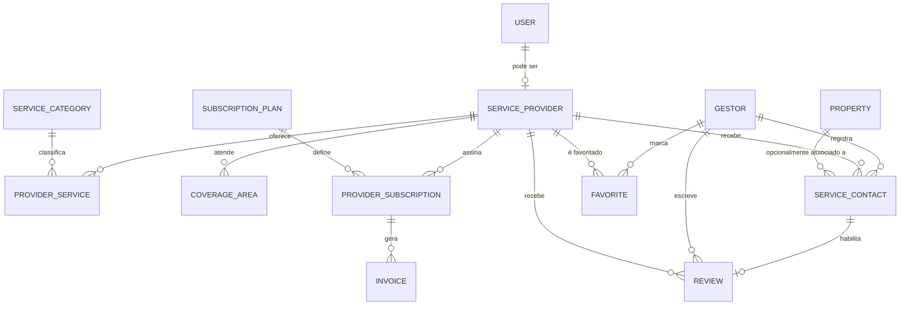
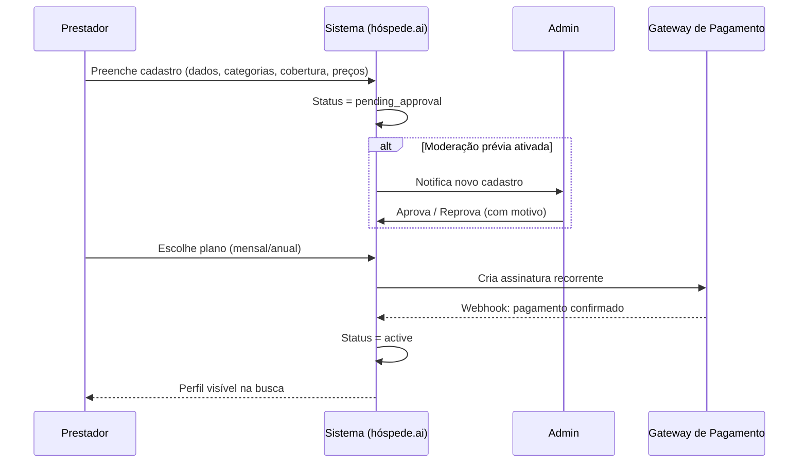
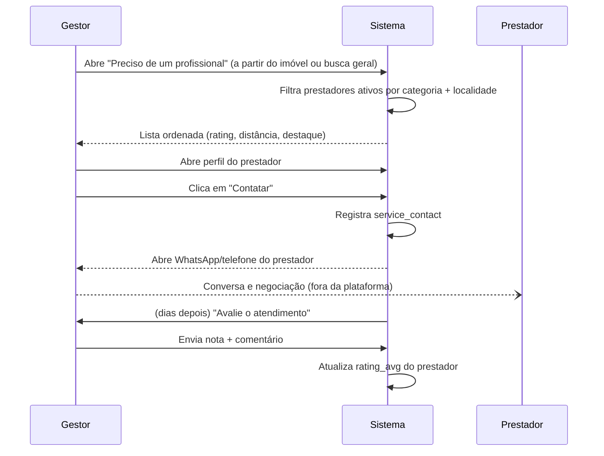
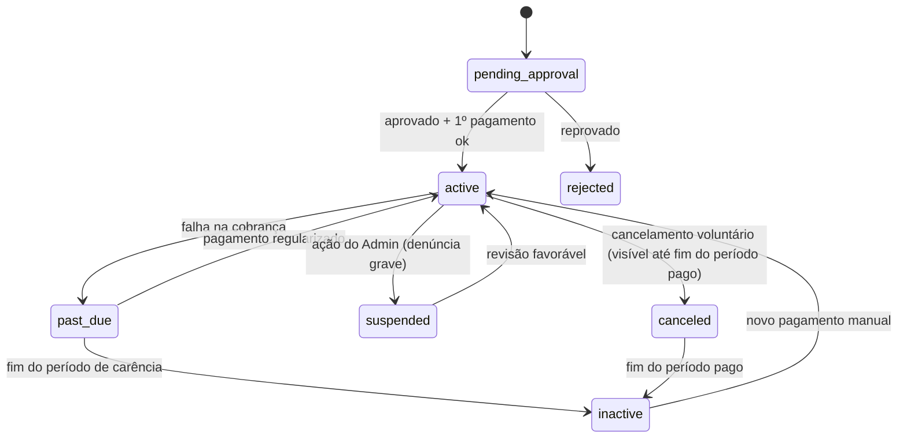

# Estudo de Viabilidade — Comunidade de Prestadores de Serviço (Marketplace de Manutenção) para hóspede.ai

**Status:** Rascunho para discussão (Rodada 1 de análise — revisado com o código real do produto)
**Data:** 2026-08-29
**Autor:** Claude Code (a pedido de Renan)
**Objetivo deste documento:** consolidar a ideia descrita, avaliar viabilidade, e especificar requisitos funcionais, não funcionais, modelo de dados, fluxos e pontos de integração — para servir de base à próxima rodada de análise e à decisão de implementação.
**Fonte técnica:** `renanrba/hospedeai-v2` (leitura direta do código e de `docs/ARQUITETURA.md` do produto).

> **Nota sobre o contexto técnico (atualizada).** A primeira versão deste documento foi escrita só com acesso ao `renanrba/amsa` (uma ferramenta pontual, o Airbnb Message Scraper & Analyzer) — sem visibilidade do produto principal. Esta revisão já lê o código real do sistema, `renanrba/hospedeai-v2`, e substitui as premissas por fatos confirmados de arquitetura (seções 8 e 10). O que ainda depende de decisão de produto/negócio continua listado na seção 15.

**Stack confirmada do hóspede.ai (`hospedeai-v2`):** React 19 + Vite no front-end (`components/`, `hooks/`, `services/`); API serverless em `api/v1/*` (Vercel Functions); banco e autenticação no Supabase (Postgres + Auth JWT + Row Level Security); multi-tenant via tabela `tenants` + `tenant_id` em cada tabela de domínio, com policies de RLS chamando `get_auth_tenant_id()`; **Stripe já integrado e em produção** para a assinatura do gestor (checkout, webhooks e billing portal, cobrando em BRL); Google Maps JS API + Leaflet/`react-leaflet` já são dependências do projeto (usados hoje para o guia de "lugares próximos" do hóspede); IA via Gemini (assistente "ARIA"). Ver `docs/ARQUITETURA.md` no próprio repositório do produto para a documentação oficial dessa arquitetura.

---

## 1. Contexto e problema a resolver

Gestores de imóveis de curta temporada (Airbnb e similares) têm uma janela de tempo curta e inflexível entre check-out e check-in (turnover) para resolver qualquer problema estrutural — elétrica, hidráulica, ar-condicionado, fechaduras, etc. Hoje essa dor é resolvida de forma informal: grupos de WhatsApp, indicação boca a boca, ou busca genérica em marketplaces não especializados (GetNinjas, 99Jobs, grupos de Facebook). Isso gera:

- Tempo de resposta lento e imprevisível;
- Nenhuma garantia de qualidade/reputação do prestador;
- Risco direto de cancelamento/reembolso da próxima hospedagem por falha não resolvida a tempo.

A proposta é criar, dentro do hóspede.ai, uma **comunidade/marketplace de prestadores de serviço** segmentada por localidade e categoria, para que gestores encontrem rapidamente mão de obra qualificada e avaliada por outros gestores da própria rede.

## 2. Modelo de negócio

- **Gestor (cliente do hóspede.ai):** usa a busca/contratação **gratuitamente** — é um benefício agregado ao produto principal (aumenta retenção e valor percebido da assinatura do gestor).
- **Prestador de serviço:** paga uma **taxa de assinatura (mensal ou anual com desconto)** para ficar **ativo e visível** no marketplace. Prestador inadimplente/inativo desaparece das buscas.
- **Pagamento do serviço em si** (o conserto do ar-condicionado, a diária de limpeza, etc.) é **combinado e pago diretamente entre gestor e prestador, fora da plataforma**. O hóspede.ai não intermedeia esse pagamento, não retém comissão sobre ele e **não deve ser confundido com um marketplace transacional** (tipo iFood) — é um **diretório/vitrine pago para o lado da oferta**, no modelo de GetNinjas/Houzz Pro, mas fechado à rede de gestores hóspede.ai.

Essa escolha de monetização (assinatura da oferta, não comissão sobre transação) tem implicações diretas no desenho do produto:
- Não precisamos de wallet, split de pagamento, escrow ou gateway de pagamento *entre usuários* — reduz muito a complexidade e a responsabilidade regulatória (não somos intermediário financeiro da transação de serviço).
- Precisamos apenas de **cobrança recorrente B2B2C** (hóspede.ai → prestador), que é um problema já bem resolvido por gateways brasileiros.
- O maior risco de negócio não é técnico, é de **cold start de marketplace** (ver seção 12): sem prestadores não há gestores interessados, sem gestores buscando não há prestadores dispostos a pagar. A estratégia de lançamento importa tanto quanto a especificação técnica.

## 3. Personas

| Persona | Descrição | Objetivo no módulo |
|---|---|---|
| **Gestor** | Usuário atual do hóspede.ai, administra um ou mais imóveis de temporada | Encontrar rapidamente, por bairro/cidade e categoria, um prestador confiável; contatar; avaliar depois |
| **Prestador de serviço** | Autônomo (MEI) ou pequena empresa (eletricista, encanador, técnico de ar-condicionado, diarista/faxina, chaveiro, dedetizadora, piscineiro, jardineiro, marido de aluguel, pintor etc.) | Ser encontrado por gestores da região, construir reputação, gerar leads recorrentes |
| **Admin hóspede.ai** | Equipe interna | Moderar cadastros, gerenciar categorias/planos, tratar denúncias, acompanhar métricas do módulo |

## 4. Escopo por fase

| Fase | Conteúdo | Racional |
|---|---|---|
| **Fase 0 — Discovery** | Validar categorias, faixa de preço da assinatura, cidades piloto, entrevistar 10-15 prestadores e gestores | Reduz risco antes de construir |
| **Fase 1 — MVP** | Cadastro de prestador, categorias fixas, cobertura por cidade/bairro (texto), busca + filtro, contato via WhatsApp/telefone (link direto, sem chat interno), avaliação pós-contato, assinatura mensal (1 gateway), painel admin básico de aprovação | Menor conjunto que já entrega valor e testa a monetização |
| **Fase 2** | Plano anual com desconto, geolocalização por raio (mapa), destaque pago/ordenação por prioridade, notificações automáticas ("avalie seu prestador"), painel do prestador com métricas de visualizações/contatos | Aumenta conversão e ARPU |
| **Fase 3 (futuro)** | Chat interno, orçamento/proposta estruturada dentro da plataforma, agenda de disponibilidade do prestador, aplicativo/PWA do prestador, split opcional de pagamento para quem quiser | Só depois de validar tração no MVP |

Este documento cobre principalmente **Fase 1 e 2** em detalhe, e lista a Fase 3 apenas como visão de longo prazo.

---

## 5. Requisitos Funcionais (RF)

### 5.1 Cadastro e perfil do prestador

- **RF-01** O prestador deve poder se cadastrar de forma independente do fluxo de gestor (landing page própria "Seja um prestador parceiro"), informando: nome/razão social, CPF ou CNPJ, telefone (WhatsApp), e-mail, foto/logo, descrição livre (bio), anos de experiência (opcional).
- **RF-02** O prestador deve selecionar **uma ou mais categorias de serviço** (ver 5.2) dentre um catálogo controlado pelo hóspede.ai (não texto livre, para permitir busca estruturada).
- **RF-03** Para cada categoria, o prestador informa um **preço base** e a unidade (visita/hora/m²/orçamento sob consulta) — apenas referencial, não vinculante.
- **RF-04** O prestador define sua **área de cobertura**: cidade(s) + bairro(s), ou raio de atuação a partir de um endereço-base (Fase 2, com geolocalização).
- **RF-05** O prestador pode anexar até N fotos de trabalhos anteriores (portfólio) — opcional no MVP.
- **RF-06** Cadastro entra como `pending_approval` até ser revisado pelo Admin (RF-30) **ou** aprovação automática com moderação reativa — decisão de produto a validar (ver seção 15).
- **RF-07** O prestador pode editar seus dados, categorias, preços e cobertura a qualquer momento; edições sensíveis (documento, categorias) podem re-disparar revisão.
- **RF-08** O prestador pode pausar voluntariamente sua visibilidade (ex.: período de férias) sem cancelar a assinatura.

### 5.2 Catálogo de categorias de serviço

- **RF-09** Catálogo inicial sugerido (editável pelo Admin): Elétrica, Hidráulica/Encanador, Ar-condicionado/Refrigeração, Limpeza/Faxina, Chaveiro, Marido de aluguel/Manutenção geral, Pintura, Jardinagem/Piscina, Dedetização/Controle de pragas, Gás (botijão/instalação), Montagem de móveis, Internet/Wi-Fi/TV.
- **RF-10** Cada categoria tem ícone, nome e descrição curta usada na busca ("Estou com problema no ar-condicionado" → mapeia para a categoria).
- **RF-11** Admin pode criar, renomear, arquivar (nunca excluir, para não quebrar histórico) categorias.

### 5.3 Busca e descoberta (lado do gestor)

- **RF-12** Ponto de entrada contextual: dentro da tela de um imóvel específico, botão "Preciso de um profissional" que já pré-carrega bairro/cidade do imóvel.
- **RF-13** Ponto de entrada geral: módulo "Comunidade de Prestadores" no menu, com busca livre por categoria + localidade.
- **RF-14** Resultado lista prestadores **ativos** (assinatura em dia) na região, com: nome, foto, categorias, nota média, nº de avaliações, preço base, distância/bairro, selo "destaque" (se plano premium).
- **RF-15** Ordenação padrão: relevância (combinação de nota média, nº de avaliações, proximidade, prestadores em destaque pagos) — critério exato a definir na Fase 2.
- **RF-16** Filtros: categoria, bairro/cidade, nota mínima, faixa de preço.
- **RF-17** Página de perfil público do prestador: bio, categorias, preços, portfólio, avaliações completas (com resposta do prestador, se houver), botão de contato.

### 5.4 Contato / geração de chamado

- **RF-18** Botão "Contatar" abre WhatsApp (link `wa.me`) ou exibe telefone — a conversa em si ocorre fora da plataforma.
- **RF-19** Cada clique em "Contatar" gera um registro interno de **lead/contato** (gestor → prestador, categoria, imóvel opcional, timestamp), usado para: (a) habilitar avaliação futura, (b) métricas para o prestador, (c) analytics do módulo.
- **RF-20** (Fase 2) Opcional: formulário curto "Descreva o problema" antes de contatar, para o prestador já chegar com contexto (pode virar mensagem pré-formatada no WhatsApp).

### 5.5 Avaliações e reputação

- **RF-21** Gestor só pode avaliar um prestador com quem tenha um registro de contato (RF-19) prévio — evita reviews falsas de quem nunca usou.
- **RF-22** Avaliação = nota 1-5 estrelas + comentário opcional + (opcional) tags rápidas ("pontual", "preço justo", "resolveu de primeira").
- **RF-23** Sistema envia, alguns dias após o contato, uma notificação/prompt "Você contratou [Prestador]? Avalie o atendimento" (RF-33).
- **RF-24** Prestador pode responder publicamente a uma avaliação (uma vez, sem editar a nota).
- **RF-25** Nota média e contagem de avaliações exibidas no perfil e nos resultados de busca; recalculadas a cada nova avaliação.
- **RF-26** Gestor pode favoritar prestadores ("meus preferidos") para acesso rápido futuro.
- **RF-27** Denúncia de avaliação abusiva/perfil falso, encaminhada para moderação do Admin.

### 5.6 Assinatura e cobrança do prestador

- **RF-28** Prestador escolhe entre plano **mensal** ou **anual (com desconto)** ao final do cadastro (ou depois, se ficou como rascunho).
- **RF-29** Cobrança recorrente automática via gateway de pagamento; falha de cobrança move o status para `past_due` com período de carência (ex.: 3-5 dias) antes de `inactive`.
- **RF-30** Somente prestadores com assinatura `active` aparecem em buscas e perfis públicos; `past_due`/`inactive`/`pending_approval`/`suspended` ficam ocultos (mas o prestador ainda acessa seu painel para regularizar).
- **RF-31** Prestador pode cancelar a qualquer momento; permanece visível até o fim do período já pago, depois some (sem reembolso proporcional, salvo definição contrária).
- **RF-32** Histórico de faturas/recibos disponível no painel do prestador.

### 5.7 Notificações

- **RF-33** Notificar prestador: novo lead/contato recebido, avaliação recebida, assinatura próxima do vencimento, pagamento falhou, conta suspensa/reativada.
- **RF-34** Notificar gestor: prompt de avaliação pós-contato, resposta do prestador à sua avaliação.

### 5.8 Painel administrativo (Admin)

- **RF-35** Fila de aprovação de novos cadastros de prestador (se moderação prévia for adotada).
- **RF-36** Gestão de categorias, planos e preços de assinatura.
- **RF-37** Busca/gestão de todos os prestadores (ativar/suspender manualmente, ex. por denúncia grave).
- **RF-38** Dashboard de métricas do módulo (ver seção 13 — KPIs).
- **RF-39** Fila de denúncias (perfis, avaliações) para tratamento manual.

---

## 6. Regras de negócio (resumo)

1. Prestador só é visível/pesquisável com assinatura `active`.
2. Avaliação exige contato prévio registrado (anti-fraude de reputação).
3. Um gestor não pode avaliar o mesmo contato mais de uma vez (1 avaliação por lead/contato; pode haver nova avaliação para um novo contato no futuro).
4. Cancelamento de assinatura não gera reembolso proporcional (a validar com jurídico/produto).
5. Prestador pode atuar em múltiplas categorias e múltiplas cidades/bairros dentro do mesmo cadastro.
6. Alterações cadastrais sensíveis (documento, categoria) podem exigir nova aprovação — evita golpe de "troca de identidade" após aprovação inicial.
7. O hóspede.ai não é parte na relação comercial do serviço contratado — apenas plataforma de descoberta e reputação (ver seção 11, aspectos legais).

---

## 7. Requisitos Não Funcionais (RNF)

| Categoria | Requisito |
|---|---|
| **Segurança** | Autenticação forte para prestador (mesmo padrão do gestor); dados sensíveis (CPF/CNPJ) criptografados em repouso; controle de acesso — prestador só edita o próprio perfil; rate limiting em endpoints de contato/busca para evitar scraping/abuso. |
| **Privacidade / LGPD** | Base legal e consentimento explícito no cadastro do prestador; política de privacidade específica do módulo; direito de exclusão de dados (anonimizar avaliações associadas em vez de apagar histórico de terceiros); minimização de dados (não coletar mais do que o necessário); registro de operações de tratamento (leads, avaliações) como dados pessoais. |
| **Disponibilidade** | O módulo deve ter degradação graciosa: se a busca/marketplace cair, não pode afetar o core do produto (gestão de imóveis). Recomenda-se isolamento de serviço/domínio. |
| **Performance** | Busca por localidade + categoria deve responder em <500ms para volumes de até dezenas de milhares de prestadores; paginação obrigatória em listagens. |
| **Escalabilidade** | Modelo de dados deve suportar crescimento multi-cidade sem redesenho (nada hardcoded por cidade). |
| **Auditoria** | Log de mudanças de status de assinatura, aprovações/reprovações, suspensões, denúncias tratadas — quem fez o quê e quando. |
| **Multi-tenancy** | O hóspede.ai isola dados por `tenant_id` com RLS (`get_auth_tenant_id()`) em toda tabela de domínio. O marketplace de prestadores é uma **exceção intencional a esse padrão**: é uma rede compartilhada entre todos os tenants/gestores, não isolada por conta — é o efeito de rede que cria valor. As tabelas novas (`service_provider`, `provider_service`, `review` etc.) não devem levar `tenant_id`; precisam de policies próprias (select público para prestadores `active`, escrita restrita ao dono via `user_id = auth.uid()`), no mesmo espírito da policy pública já usada em `guide_nearby_places` ("Allow public read access ... USING (true)"). |
| **Pagamentos** | PCI-DSS já delegado ao Stripe hoje (nenhum dado de cartão passa pelo hóspede.ai). Reaproveitar o mesmo padrão de `api/v1/billing.js` (checkout session + webhook idempotente + billing portal) para a assinatura do prestador, com Products/Prices próprios no Stripe. O checkout atual não declara `payment_method_types` explícito (fica no padrão cartão do Checkout) — **confirmar se boleto/PIX estão habilitados na conta Stripe** antes de assumir que já cobrem o público autônomo/MEI (seção 15). |
| **Observabilidade** | Métricas de negócio (KPIs da seção 13) e métricas técnicas (latência de busca, taxa de erro de cobrança) monitoradas. |
| **Internacionalização** | Não crítico no MVP (mercado BR), mas evitar hardcode de formatos (CPF/CNPJ, moeda) que impeçam expansão futura. |
| **Acessibilidade** | Interface de busca/perfil deve seguir os mesmos padrões de acessibilidade já usados no produto principal. |

---

## 8. Modelo de dados (proposta lógica)

### Entidades principais

- **service_provider**: id, user_id (fk auth), nome/razão social, documento (cpf/cnpj), telefone, email, bio, avatar_url, status (`pending_approval`, `active`, `past_due`, `inactive`, `suspended`), rating_avg, rating_count, created_at, approved_at.
- **service_category**: id, nome, slug, ícone, ativo (bool).
- **provider_service**: provider_id, category_id, preco_base, unidade_preco, descricao.
- **coverage_area**: provider_id, cidade, estado, bairro (nullable = cidade toda), lat/lng + raio_km (Fase 2).
- **subscription_plan**: id, nome, periodicidade (`monthly`/`yearly`), preco, desconto_pct, features (jsonb: destaque, limite_categorias, etc.).
- **provider_subscription**: provider_id, plan_id, status (`trialing`,`active`,`past_due`,`canceled`), current_period_start, current_period_end, gateway_customer_id, gateway_subscription_id.
- **invoice**: subscription_id, valor, status (`paid`,`failed`,`pending`), paid_at, gateway_transaction_id.
- **service_contact** (lead): gestor_id, provider_id, category_id, property_id (nullable), mensagem (opcional), canal (`whatsapp`/`telefone`), created_at.
- **review**: service_contact_id (unique), gestor_id, provider_id, nota (1-5), comentario, resposta_prestador, created_at.
- **favorite**: gestor_id, provider_id, created_at.
- **audit_log**: entidade, entidade_id, ação, ator, payload_antes/depois, created_at.

> **Confirmado no código.** `hospedeai-v2` já tem `public.tenants` (id, plan, status, `stripe_customer_id`, `stripe_subscription_id`), `public.users` (complementa `auth.users`, com `tenant_id` e `role` admin/member) e `public.properties` (`tenant_id`, `name`, `address` **em texto livre, sem lat/lng nem campos estruturados de cidade/bairro**, `status` Ativo/Manutenção/Inativo, `rating`, etc.). Ou seja: RF-12 (pré-carregar bairro/cidade do imóvel) não é imediato — hoje não há geocodificação de `properties.address`; é preciso geocodificar sob demanda (dá para reaproveitar a dependência `@googlemaps/js-api-loader` já presente no projeto, no mesmo padrão usado pela feature `guide_nearby_places`) ou pedir a cidade/bairro ao gestor na primeira busca. Também confirmado: `service_provider`/`review`/`favorite` não devem referenciar `tenants` — o prestador é um principal novo, ligado direto a `auth.users(id)`, sem vínculo de tenant (ver seção 10).

---

## 9. Fluxos principais

### 9.1 Cadastro e ativação do prestador

### 9.2 Busca e contato pelo gestor

### 9.3 Inadimplência e reativação

---

## 10. Integração com o sistema atual — pontos de atenção

Esta seção foi reescrita após leitura direta de `renanrba/hospedeai-v2` (código + `docs/ARQUITETURA.md` do próprio produto). O sistema segue uma regra de camadas explícita: **componentes nunca falam com Supabase ou API diretamente**, sempre via `services/`; `services/` usam o cliente Supabase (chave `anon` + RLS) para CRUD que pertence só ao usuário logado; qualquer coisa com segredos, billing, webhooks ou consulta **cross-tenant** vai obrigatoriamente por `api/v1/*`. O marketplace de prestadores se encaixa assim:

1. **Identidade** — o prestador **não** deve virar uma linha em `public.users` (que hoje sempre carrega `tenant_id` e role admin/member de um tenant). Ele é um principal novo: `service_provider.user_id references auth.users(id)`, autenticado pelo mesmo Supabase Auth, mas sem tenant. Isso também define a regra de RLS: as policies de tenant (`get_auth_tenant_id()`) não se aplicam aqui — precisa de uma função equivalente tipo `is_provider_owner(provider_id)` comparando com `auth.uid()`.
2. **Leitura pública sem servidor** — como a busca de prestadores é intencionalmente cross-tenant (rede compartilhada) mas **não** envolve segredo nenhum, ela pode seguir o padrão já usado em `guide_nearby_places` (`FOR SELECT USING (true)` para registros ativos) e ser lida direto via `services/` com RLS, sem precisar passar por `api/v1/*`. Só o que envolve Stripe/moderação cross-tenant (aprovação, suspensão, cobrança) precisa de endpoint dedicado.
3. **Cobrança** — Stripe **já está em produção** no hóspede.ai (`api/v1/billing.js`: `create_checkout_session`, `webhook`, `billingPortal.sessions.create`), cobrando o gestor em BRL com um objeto `PLANS` (free/pro/enterprise) definido em `lib/billing/index.js`. Recomenda-se **espelhar exatamente esse padrão** para o prestador: um objeto `PROVIDER_PLANS` (mensal/anual), Products/Prices próprios no Stripe, um `provider_subscription` análogo a `tenants.stripe_customer_id`/`stripe_subscription_id`, e um handler de webhook separado (ou uma branch dentro do handler existente, discriminando por `metadata` do evento) que atualiza `service_provider.status` em vez de `tenants.plan`. Evita reinventar a idempotência de webhook que já existe.
4. **Geolocalização** — `@googlemaps/js-api-loader` e `leaflet`/`react-leaflet` já são dependências do projeto e já resolvem geolocalização em produção (feature de "lugares próximos" do guia do hóspede, com lat/lng gravados em `guide_nearby_places`). Reaproveitar o mesmo padrão para: (a) geocodificar a cobertura do prestador (RF-04) e (b) — quando possível — geocodificar `properties.address` sob demanda para popular a busca contextual (RF-12), já que hoje esse campo é texto livre sem lat/lng (seção 8).
5. **Navegação** — novo item de menu para o gestor (a `AuthContext` atual só resolve sessão de tenant, então essa é uma tela nova de gestor autenticado); onboarding do prestador fica **fora** desse fluxo, como uma landing pública própria ("Seja um prestador parceiro"), similar em espírito às páginas de `components/products/*` que hoje descrevem os produtos do hóspede.ai para o público externo — mas com fluxo de cadastro + checkout, não só marketing.
6. **Notificações** — o produto já tem `app.js` (`chat`, `support-chat`, `activities-log`) e um assistente de IA (ARIA); vale avaliar mais adiante se cabe ao ARIA sugerir o módulo quando o gestor relatar um problema em texto ("ar-condicionado quebrado" → sugestão de abrir a busca de prestadores) — não é MVP, mas é um gancho natural de produto já existente.
7. **Isolamento de schema** — mesmo padrão do resto do banco: migrations dedicadas em `supabase/migrations/`, tabelas novas sem acoplamento a `properties`/`reservations` além da referência opcional `property_id` em `service_contact`. Não requer schema Postgres separado — o projeto já mantém tudo em `public.*` com isolamento por RLS, não por schema.

---

## 11. Aspectos legais e compliance

- **Papel do hóspede.ai**: deixar contratualmente claro nos Termos de Uso que a plataforma é um **diretório/vitrine de prestadores independentes**, não contrata, não fiscaliza execução do serviço, e não é parte na relação comercial entre gestor e prestador (mitiga responsabilidade civil por serviço malfeito, atraso, dano ao imóvel etc.).
- **Nota fiscal**: emissão de NF do serviço prestado (ar-condicionado, limpeza etc.) é responsabilidade do prestador — fora do escopo da plataforma. O hóspede.ai emite NF apenas da **própria assinatura** cobrada do prestador.
- **LGPD**: tratamento de CPF/CNPJ e dados de contato do prestador exige base legal (execução de contrato) e política de privacidade própria; avaliações contêm dados pessoais do gestor (autor) e opinião sobre o prestador — ambos precisam de tratamento adequado (retenção, direito de exclusão/anonimização).
- **Cadastro/verificação**: recomenda-se, no mínimo, validação de formato de CPF/CNPJ e confirmação de telefone (OTP); verificação documental mais forte (selfie + doc) pode ser Fase 2/3 como diferencial de confiança ("prestador verificado").
- **Cancelamento/reembolso de assinatura**: definir política clara (ex.: sem reembolso proporcional, conforme CDC permite para contratos de prestação continuada, desde que informado previamente).

---

## 12. Riscos e mitigações

| Risco | Impacto | Mitigação |
|---|---|---|
| **Cold start** (poucos prestadores no lançamento → gestores não voltam) | Alto | Lançar em 1-2 cidades piloto com curadoria manual/prospecção ativa de prestadores; oferecer trial gratuito nos primeiros meses; recrutar prestadores já indicados informalmente pelos gestores atuais (pesquisa com base de clientes) |
| **Avaliações falsas/manipuladas** | Médio | Exigir contato registrado antes de avaliar (RF-21); rate limit de avaliações por gestor/prestador; moderação reativa por denúncia |
| **Prestador fantasma/golpe** (cobra e não aparece) | Alto (reputacional) | Moderação de cadastro na Fase 1; canal de denúncia visível; suspensão rápida por Admin |
| **Concorrência de marketplaces genéricos** (GetNinjas etc.) | Médio | Diferencial = rede fechada e contextualizada ao imóvel/urgência de temporada, não é preciso vencer no volume, só na relevância para esse nicho |
| **Baixo ARPU / churn de prestador sem leads suficientes** | Médio | Painel do prestador com métricas de visualização/contato (mostrar valor); plano de destaque pago como upsell, não como barreira de entrada |
| **Sazonalidade regional** (poucas cidades com massa crítica) | Médio | MVP com foco geográfico deliberado (cidades onde já há concentração de gestores hóspede.ai) |
| **Responsabilidade legal por serviço malfeito** | Alto se mal contratualizado | Termos de uso claros (seção 11) + disclaimer visível nas telas de contato |

---

## 13. Métricas de sucesso (KPIs)

- Nº de prestadores com assinatura `active`, por cidade/categoria
- MRR do módulo (receita recorrente de assinaturas)
- Taxa de conversão busca → contato (service_contact / buscas)
- Taxa de avaliação pós-contato (reviews / contacts)
- Nota média da rede e distribuição por categoria
- Churn mensal de assinaturas de prestador
- Tempo médio entre cadastro do prestador e primeiro lead recebido (mostra "time to value")
- % de gestores ativos que já usaram o módulo ao menos uma vez (adoção)

---

## 14. Estimativa de esforço (alto nível, não é um plano de sprint)

| Fase | Escopo | Estimativa |
|---|---|---|
| Fase 0 — Discovery | Entrevistas, definição de categorias/preços/cidades piloto | 1-2 semanas |
| Fase 1 — MVP | Cadastro, catálogo, busca simples, contato, avaliação, 1 gateway, admin básico | 6-8 semanas (1 squad full-stack) |
| Fase 2 — Growth | Geolocalização, plano anual, destaque pago, notificações automáticas, painel de métricas do prestador | 4-6 semanas |
| Fase 3 — Futuro | Chat interno, orçamento estruturado, agenda de disponibilidade, app do prestador | A avaliar após tração do MVP |

(Estimativas grosseiras para dimensionamento de negócio; refinar em planning técnico quando a decisão de implementar for tomada.)

---

## 15. Perguntas em aberto para a próxima rodada

Respondidas nesta revisão, com base no código de `hospedeai-v2` (removidas da lista): existe auth/base de usuários reaproveitável (Supabase Auth); existe gateway de pagamento em uso (Stripe, já cobrando em BRL); existe base de geolocalização no stack (Google Maps + Leaflet). Seguem em aberto, porque dependem de decisão de produto ou de algo que não dá para confirmar só lendo o código:

1. **PIX/boleto no Stripe** — o checkout atual não declara `payment_method_types` explícito no código revisado. Isso depende de configuração da conta Stripe (dashboard), não do código. Precisa confirmar se boleto/PIX já estão habilitados, ou se será preciso ativá-los/complementar com outro meio de pagamento para agradar o público autônomo/MEI.
2. Moderação de cadastro será **prévia** (aprovação manual antes de aparecer) ou **reativa** (aparece direto, moderação só por denúncia)? Isso muda bastante o esforço operacional inicial.
3. Quais cidades/regiões fazem sentido para o piloto, com base na concentração atual de gestores hóspede.ai (dado que não temos acesso a métricas de uso/base de tenants por região)?
4. Faixa de preço da assinatura do prestador (mensal e anual) — já existe uma hipótese, ou parte de pesquisa de mercado (GetNinjas Profissionais, Houzz Pro etc.)?
5. Haverá período de trial gratuito para os primeiros prestadores (estratégia de cold start)?
6. O prestador poderá ser, ao mesmo tempo, gestor de imóveis (dupla persona)? O modelo de dados proposto (seção 8) já assume que não — prestador é um principal separado, sem `tenant_id` — mas vale confirmar se isso bloqueia algum caso de uso real (ex.: um gestor que também presta serviço para outros gestores).
7. Vale a pena investir, ainda na Fase 1, em geocodificar `properties.address` (hoje texto livre) para viabilizar o RF-12 completo, ou o MVP pode pedir cidade/bairro manualmente ao gestor na primeira busca e deixar a geocodificação automática para a Fase 2?

---

## 16. Próximos passos sugeridos

1. Validar este documento e responder às perguntas da seção 15.
2. Rodar Fase 0 (discovery) com uma amostra pequena de gestores e prestadores reais.
3. Prototipar wireframes das telas críticas: cadastro do prestador, busca do gestor, perfil público, fluxo de avaliação.
4. Só então detalhar o plano técnico de implementação (schema definitivo, escolha de gateway, escolha de abordagem de geolocalização) para a Fase 1.
